

# OGEX

### A node-based engine for live graphics, audio, lighting, and interactive media on macOS.

[**Download for macOS (0.2.4)**](https://get.ogex.app/OGEX-0.2.4.dmg) · [Features](https://ogex.app/features)

---

OGEX is a node graph engine for building live visuals and interactive systems. You drag boxes onto a canvas, wire them together, and data flows through the graph. Each box does one job. A webcam, a blur, a shader, a particle emitter, a DMX universe. Wire them up and a preview updates live while you drag a slider. There is no compile step and no render-and-wait.

If you have used TouchDesigner, Max/MSP, vvvv, Notch, or Houdini, the node-graph idea will feel familiar. One dataflow graph drives the parts described below: GPU rendering, shaders, geometry, physics, audio, MIDI, OSC, DMX lighting, NDI, and projection mapping.

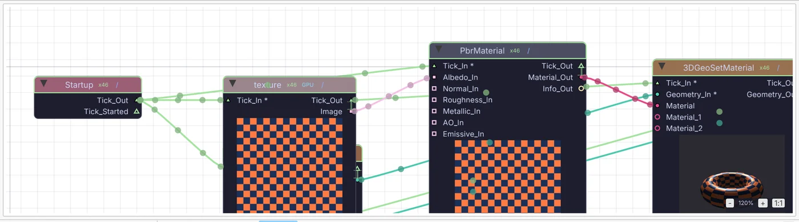

## Download

This repository is the macOS binary release.

- **[OGEX-0.2.4.dmg](https://get.ogex.app/OGEX-0.2.4.dmg)**. macOS 11 (Big Sur) or later, Apple Silicon (M-series), notarized by Apple.
- Open the DMG and drag OGEX to Applications. It is signed with a Developer ID and notarized, so it launches normally.
- Graphs save as plain JSON, so your projects are portable and easy to keep in version control.

## What is inside

### 3D rendering and PBR materials

Rendering is a Vulkan rasterizer (ash), with a CPU fallback and a per-node auto/GPU/CPU switch. Every render writes color, depth, and normals together, in Blinn-Phong or Cook-Torrance GGX. There are eight material types: PbrMaterial does the full metal-roughness set with triplanar projection and parallax height, and the rest cover Phong, unlit, wireframe, depth, lines, point sprites, and ShaderMaterial for your own WGSL or GLSL.

Up to 64 lights, with soft shadows on 8 of them. Drop in an HDRI and image-based lighting bakes the irradiance and reflections once and caches it; a cubemap probe handles live reflections. Cameras go from plain perspective to fisheye and a custom projection matrix. Anti-aliasing is SSAA or TAA, tone mapping is ACES, Reinhard, or filmic, and bloom, SSAO, and depth of field live in separate image nodes you hang off the render. Geometry stays on the GPU between frames, instances from four copies up, and imports from OBJ, glTF, FBX, USD, and Alembic.

`PBR` · `Cook-Torrance GGX` · `Blinn-Phong` · `metallic-roughness` · `shadow mapping` · `PCF soft shadows` · `image-based lighting` · `IBL` · `HDRI` · `SSAA` · `TAA` · `fisheye camera` · `tone mapping` · `ACES` · `glTF` · `USD` · `Alembic`

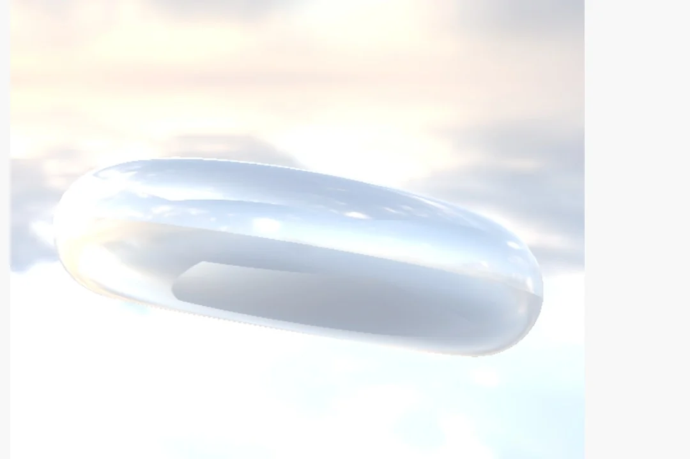

### Custom shaders (WGSL, GLSL, Shadertoy)

Write WGSL or GLSL inline and it compiles live, with errors mapped back to your own line numbers rather than the prologue. ImageShader is 2D compute over images: up to 8 inputs, 7 outputs, and up to 64 ping-pong passes, so blur stacks and feedback need no wired loop. ShaderMaterial is a custom vertex and fragment material that falls back to PBR if it fails to compile. AttributeShader runs compute over geometry, one thread per point or primitive.

Uniforms are declared in JSON and edited live, and a TouchDesigner-style prologue plus an `#include` system supply noise, lighting, SDF, color, and Shadertoy helpers. Set `shadertoy_compat` and a classic `mainImage` body ports with small edits. A bad recompile keeps the last working shader on screen and flags the error, so you fix it without losing your output. Right-click a PbrMaterial and Dump Source hands you an editable ShaderMaterial to start from.

`WGSL` · `GLSL` · `Shadertoy` · `compute shader` · `fragment shader` · `vertex shader` · `multi-pass` · `multiple render targets` · `specialization constants` · `vertex skinning` · `shader hot reload`

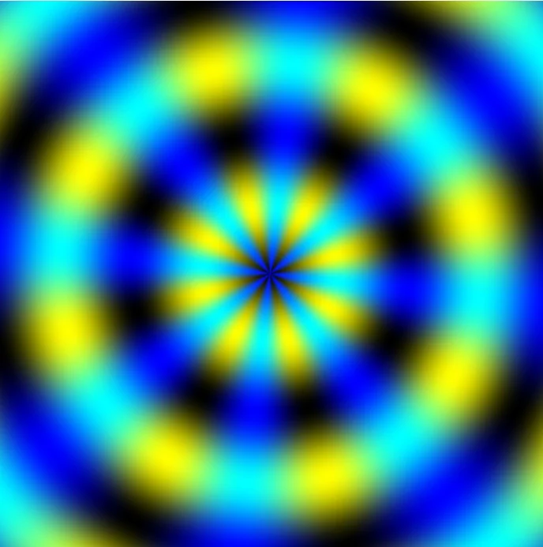

### Image processing and compositing

The Image nodes cover grading, filters, compositing, distortion, and stylize. Grading runs lift/gamma/gain, curves, LUTs, white balance, histogram match, and tone mapping, with color-space conversion across RGB, HSL, Lab, YUV, and ACES. ImageBlur has nine kernels plus dedicated bilateral, kuwahara, bokeh, and tilt-shift nodes, and edge detection runs sobel through canny.

Compositing layers with real blend modes: ImageAlphaOver has 29, ImageComposite 44, alongside chroma and luma key, difference matte, and depth compositing. Distortion and layout cover lens distort, chromatic aberration, kaleidoscope, swirl, pixel-sort, slit-scan, and UV remap, and the temporal nodes do feedback, frame delay, trails, and time warp. Every image node has an Application/GPU/CPU switch, and chains stay GPU-resident end to end where the format allows.

`color grading` · `Gaussian blur` · `convolution kernel` · `chroma key` · `luma key` · `blend modes` · `CLAHE` · `LUT` · `lens distortion` · `chromatic aberration` · `kaleidoscope` · `pixel sort` · `slit scan` · `Canny` · `premultiply`

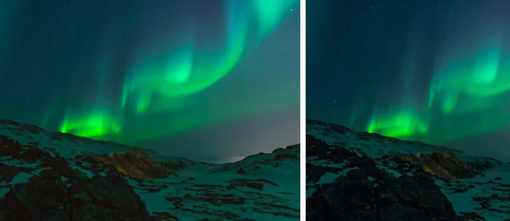

### Image generators and procedural textures

Image generators need nothing wired in; they build from their parameters. ImageNoiseGen covers Perlin, simplex, worley, and a stack of others, ImageMandelbrot renders Mandelbrot and Julia with deep zoom, and ImageVoronoi scatters cells. ImageReactionDiffusion grows spots, stripes, and labyrinths from a Gray-Scott sim with 40 presets, and every parameter can be painted per pixel by another image chain. ImageCellularAutomaton runs Life, WireWorld, and custom rules.

Pattern and texture generators handle bricks, hex tiles, Truchet, checker, gradients, woven canvas, cracked mud, Chladni figures, and phasor caustics. ImageSimpleExpression evaluates a math expression at every pixel for masks and channel mixing without writing a full shader.

`procedural noise` · `Perlin` · `simplex` · `worley` · `Voronoi` · `Mandelbrot` · `Julia` · `reaction diffusion` · `Gray-Scott` · `cellular automaton` · `Conway's Life` · `Truchet` · `Chladni` · `phasor noise` · `gradient generator` · `SMPTE bars`

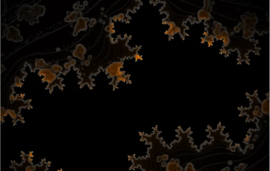 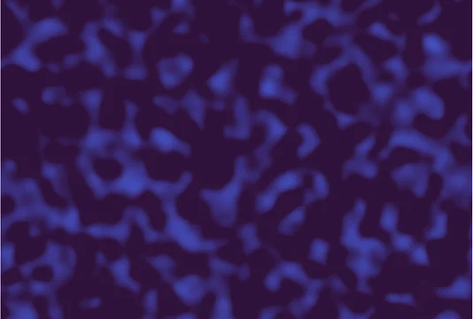

### Geometry, NURBS, and signed distance fields

The procedural modeling nodes carry the 3DGeo prefix. You get the usual primitives, boolean CSG that can tag the cut seam, Catmull-Clark and Loop subdivision, and adaptive remeshing. Deformers run bend, twist, taper, lattice, delta mush, shrinkwrap, and a couple dozen more, plus Voronoi fracture, L-systems, and metaball and marching-cubes surfacing. Topology, UV, and instancing tools round it out, and a 26-node attribute family creates, transfers, blurs, and randomizes point and primitive attributes. Import and export both cover OBJ, FBX, glTF, PLY, STL, USD, and Alembic.

NURBS curves and surfaces revolve, sweep, loft, trim, fillet, and intersect for true CAD-style modeling. Signed distance fields move through a Volume port: build exact SDF primitives up to 512 voxels, smooth-boolean them, bake a mesh into a field or march it back out, and shell, roughen, repeat, and sample along the way. TextSDF renders text into a field that stays sharp at any size.

`procedural geometry` · `boolean CSG` · `Catmull-Clark` · `remesh` · `Voronoi fracture` · `metaball` · `marching cubes` · `L-system` · `lattice deform` · `delta mush` · `pelt unwrap` · `NURBS` · `B-spline` · `loft` · `revolve` · `SDF` · `signed distance field` · `smooth boolean` · `voxel`

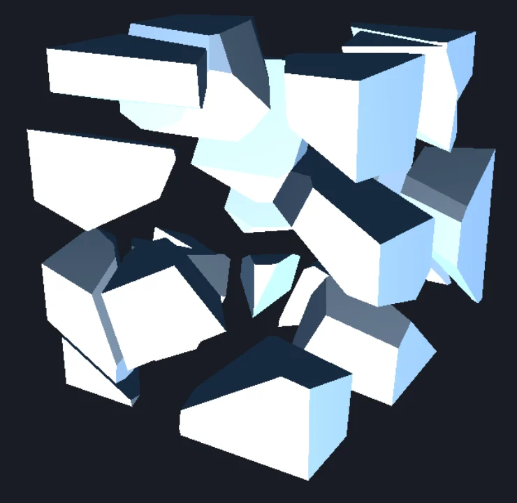 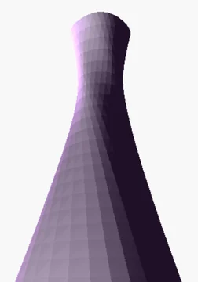 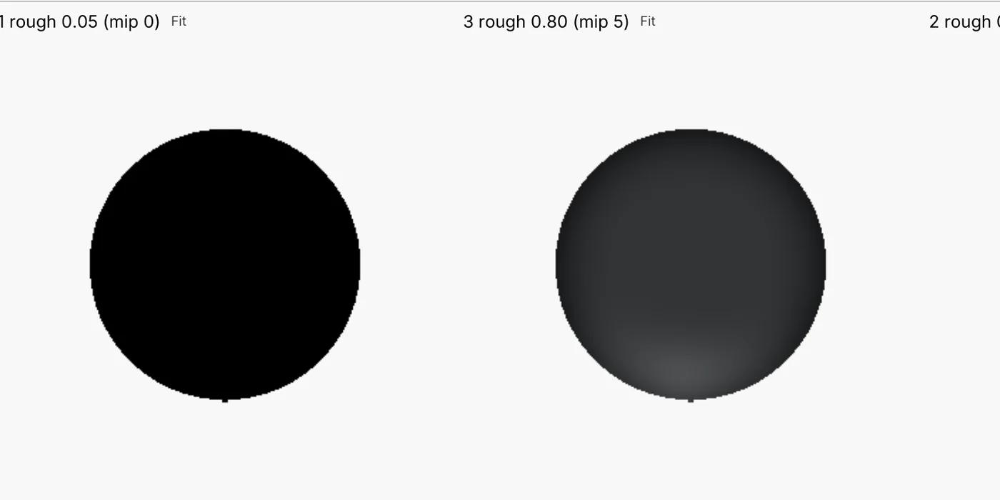

### SVG and vector graphics

The SVG nodes build, transform, and render vector documents inside the graph: shape generators, compound-path booleans, path morph and offset, text on a path, and generative pieces like Voronoi, circle packing, and Lissajous. It bridges both ways too, extruding paths into 3D meshes, flattening meshes back to wireframe, and rasterizing to and from images.

`SVG` · `vector graphics` · `compound path` · `path morph` · `circle packing` · `Lissajous` · `text on path` · `SVG to geometry` · `geometry to SVG` · `bar chart`

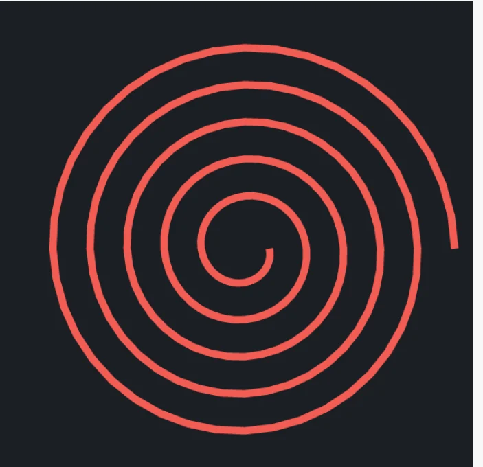

### GPU particles

Particles carry the 3DGeoParticle prefix and scale to 10 million live. There are two emitter models. The simple emitter births, simulates, and kills in one node, for quick emit-to-render graphs. The chain emitter splits lifecycle, forces, and integration into separate nodes, so a stack of force nodes (wind, vortex, attract, orbit, flocking, drag, spin, and more) composes cleanly while the solver handles the physics. Collision bounces or sticks particles off boxes, spheres, and meshes.

Render them as instanced geometry, ribbons, trails, or billboarded sprites. Stream operators split, group, and spawn-on-event for sparks and debris, and per-particle color ramps, texture lookups, and expressions style the look.

`GPU particles` · `particle emitter` · `chain solver` · `flocking` · `boids` · `vortex` · `attractor` · `point sprites` · `ribbon` · `trail` · `substeps` · `particle collision` · `color ramp`

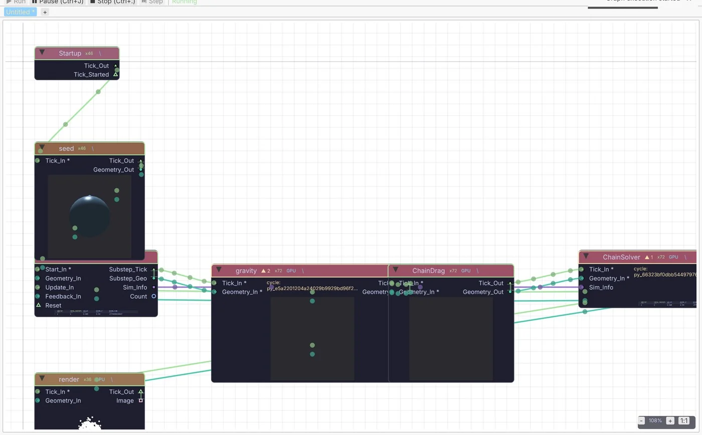 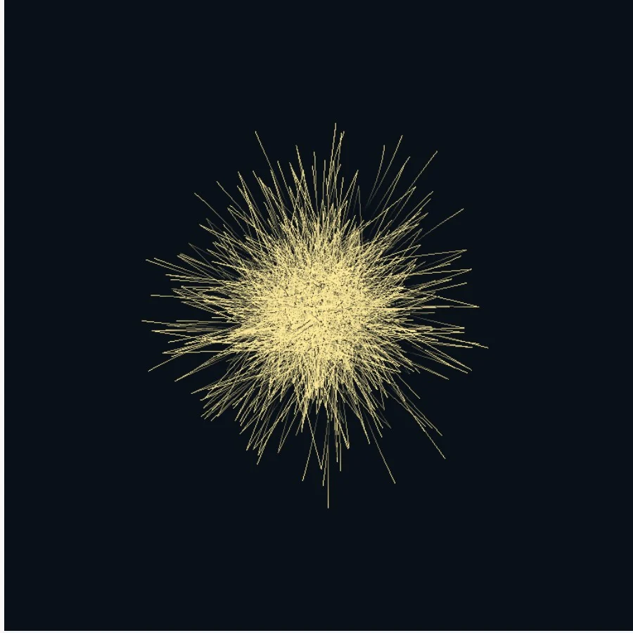

### Physics: soft bodies, cloth, and rigid bodies

Two engines. PBDSim is an XPBD solver for the soft stuff: cloth, hair, soft bodies, grain, and inflatables. You don't wire its constraints by hand. A recipe node takes a mesh or some curves and builds the setup for you, one each for cloth, hair, grain, softbody, balloon, and a stuffed-animal preset with whole-body shape matching. Cloth tears and goes plastic. Soft bodies run on tetrahedra with volume preservation, or on struts ray-cast through a shell. Balloons hold their air. When you want the constraints in your own hands instead, PBDSimConstraints exposes all 19 types. PBDSimSolverFrameRange bakes an offline run in a single tick, and PBDSimIO caches the result to disk for sub-frame playback.

The Physics nodes are a separate rigid-body engine. PhysicsWorld sets gravity and the timestep, in 2D or 3D. PhysicsBody covers dynamic, static, and kinematic bodies in the usual shapes, from boxes through convex hulls to trimeshes. PhysicsConstraint has the standard joints (fixed, hinge, slider, ball, spring, rope), each with a break threshold so it snaps under load. PhysicsMotor drives a joint, PhysicsGlueConstraint fractures bonded bodies and propagates the break to their neighbors, and PhysicsRaycast reports what it hit. PhysicsExtractTransforms hands every body's transform to an instancer, and PhysicsDebugRender draws the shapes and contacts as wireframe.

`XPBD` · `position-based dynamics` · `cloth simulation` · `soft body` · `tetrahedral` · `ARAP` · `hair simulation` · `grain` · `pressure constraint` · `shape matching` · `rigid body dynamics` · `joints` · `motor` · `fracture` · `glue constraint` · `raycast` · `continuous collision detection`

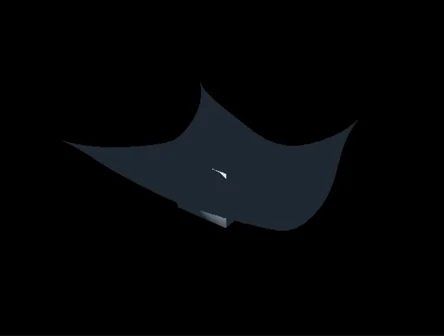 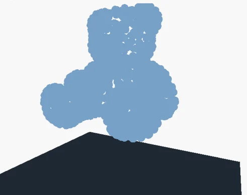 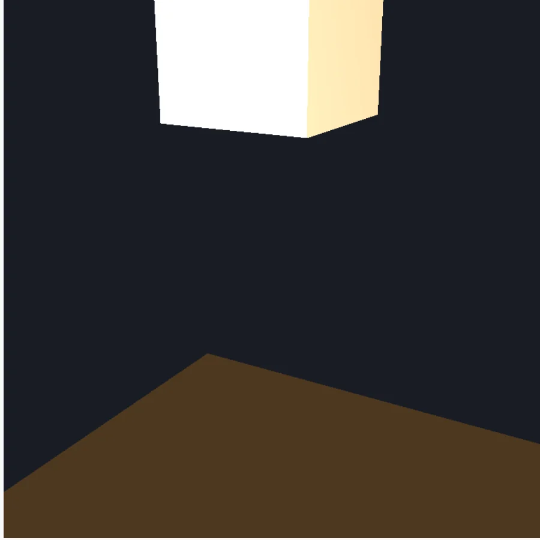

### Procedural terrain and generative geometry

Terrain is heightfield-based: a 2D grid that is cheap to push around before it becomes a mesh. Erosion comes in eight flavors (hydraulic, thermal, wind, glacial, coastal, and more), stream-power incision pairs with tectonic uplift to carve mountains, and hydrology nodes write drainage, flow, and stream order as per-cell data. Terracing, masking by slope and height, domain-warp distortion, and Poisson-disk scatter handle the shaping and the prop placement.

Export goes straight to game engines: 16-bit height and weight maps in Unreal Landscape layout, Unity RAW16 plus splats, or chunked OBJ and FBX. One graph can feed Unreal and Unity at once.

`heightfield` · `terrain generation` · `hydraulic erosion` · `thermal erosion` · `glacial erosion` · `stream power` · `tectonic uplift` · `Strahler` · `terrace` · `domain warp` · `slope mask` · `Poisson disk` · `Unreal Landscape` · `Unity terrain` · `RAW16` · `splatmap`

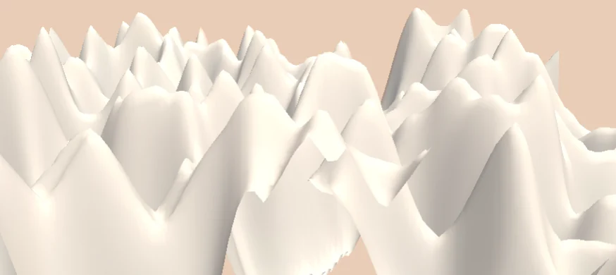 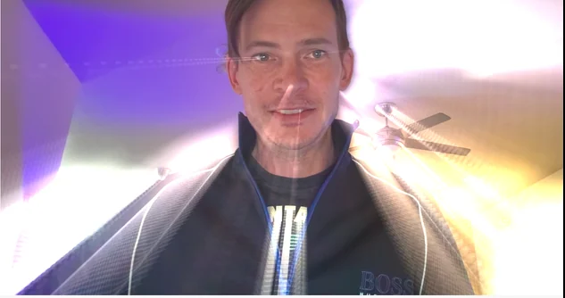

### Audio synthesis, analysis, and plugins

The audio nodes carry the Audio prefix and cover synthesis, analysis, effects, and a plugin host. Synthesis runs oscillators, FM, wavetable, granular, Karplus-Strong, modal, and waveguide physical models. Analysis reports FFT, spectrum, BPM and onset detection, pitch, key and chord, and a BS.1770 LUFS meter. Filters and dynamics are the full set, from ladder and state-variable filters to compressors, limiters, and transient shapers.

Effects cover reverb (plate, spring, convolution), delays, chorus, phaser, distortion, pitch shift, time stretch, and a vocoder, plus first-order ambisonic encode and decode. PluginHost loads CLAP, VST3, and LV2 inline, optionally out of process so a plugin crash can't take the studio down, with the plugin's own GUI. Audio I/O runs through CoreAudio.

`FM synthesis` · `wavetable` · `granular` · `Karplus-Strong` · `modal synthesis` · `waveguide` · `FFT` · `STFT` · `vocoder` · `convolution reverb` · `LUFS` · `BS.1770` · `pitch detection` · `beat tracking` · `ladder filter` · `parametric EQ` · `transient shaper` · `CLAP` · `VST3` · `LV2` · `CoreAudio`

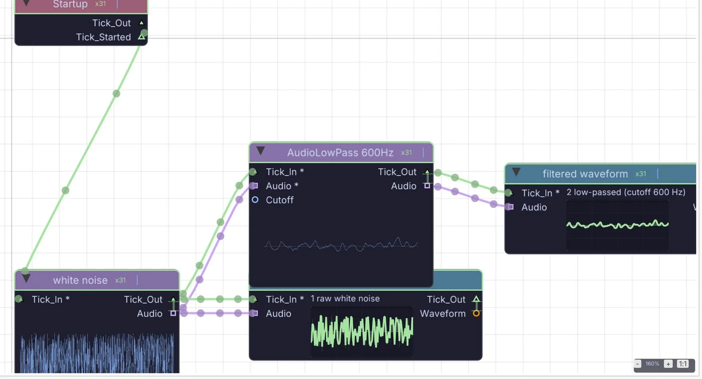

### Channel Data multi-channel streams

Channel Data is a named multi-channel stream. Its nodes do math, logic, smoothing, LFOs, patterns, and expressions, and converters bridge it to and from audio, MIDI, DMX, geometry, image, and JSON. So an FFT magnitude or a beat detector can drive DMX channels, MIDI notes, or geometry attributes without leaving the graph. OSC and file nodes move channels in and out.

`channel data` · `multi-channel stream` · `control signal` · `audio to MIDI` · `audio to DMX` · `OSC channels` · `signal conversion`

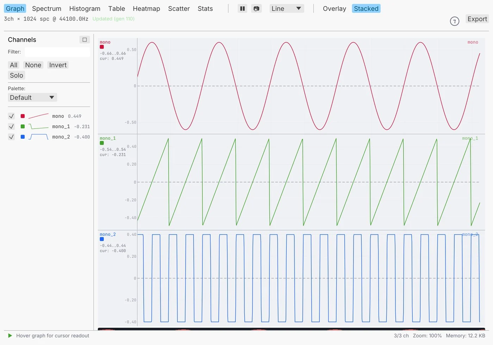

### MIDI: routing, clock, sequencers, and network MIDI

MIDI handles note, CC, pitch bend, pressure, RPN/NRPN, SysEx, and timecode, in and out. Routing covers merge, router, channel map, keyboard split, and thru. MPE decodes per-voice pitch, pressure, and timbre for the Roli Seaboard, LinnStrument, and Haken Continuum. Network MIDI runs over RTP-MIDI (AppleMIDI) and ipMIDI. Clock nodes divide, multiply, smooth, and tap tempo, and the sequencers cover a Euclidean generator, step and pattern sequencers, an arpeggiator, and piano-roll clip playback, all able to follow a shared project transport.

Soft takeover, MIDI learn with pickup and curve, and voice allocation with glide handle live control. A patch librarian stores, diffs, and steps a setlist saved in the project, alongside program change, snapshot fire, MIDI Tuning, and MIDI-CI and device-inquiry nodes. A device-profile library ships nine controllers plus General MIDI. Standard MIDI Files read and write, and bridges convert MIDI to channel data, gates, or monophonic audio-to-MIDI.

`MIDI` · `RTP-MIDI` · `AppleMIDI` · `ipMIDI` · `MPE` · `Roli Seaboard` · `LinnStrument` · `MIDI-CI` · `NRPN` · `SysEx` · `MIDI Show Control` · `MMC` · `Euclidean sequencer` · `arpeggiator` · `MIDI clock` · `MIDI Learn` · `soft takeover` · `voice allocation` · `patch librarian`

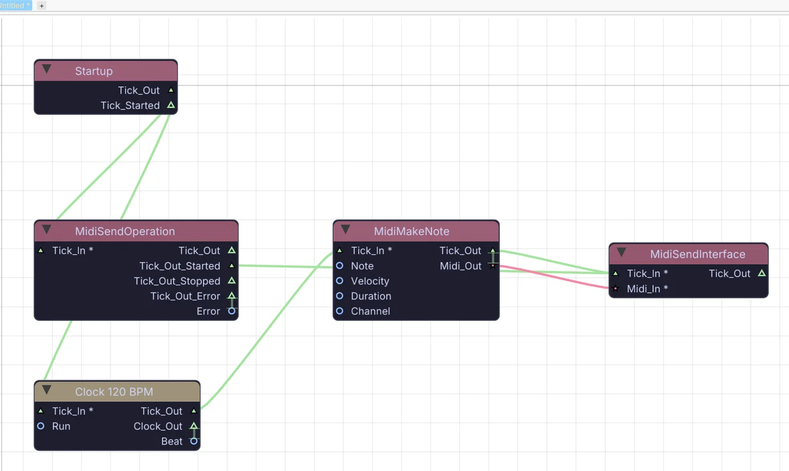

### OSC and Ableton Live

The OSC nodes send, receive, build, and unpack messages and bundles, with converters to and from floats, vec3s, and typed data. OSCRewrite remaps addresses, OSCRecorder captures a stream, and OSCQuery publishes and discovers namespaces both ways.

The Ableton nodes drive Live over AbletonOSC: tempo and beat from AbletonLiveLink, direct LOM get/set/subscribe from AbletonLiveControl, clip and scene launching, the clip matrix, device parameters, groove pool, and cue points. PushSurface reads an Ableton Push 2 or 3 over USB and writes pad colors back.

`OSC` · `Open Sound Control` · `OSCQuery` · `OSC bundle` · `address rewrite` · `Ableton Live` · `AbletonOSC` · `LOM` · `clip launch` · `groove pool` · `cue point` · `Ableton Push` · `Push 2` · `Push 3`

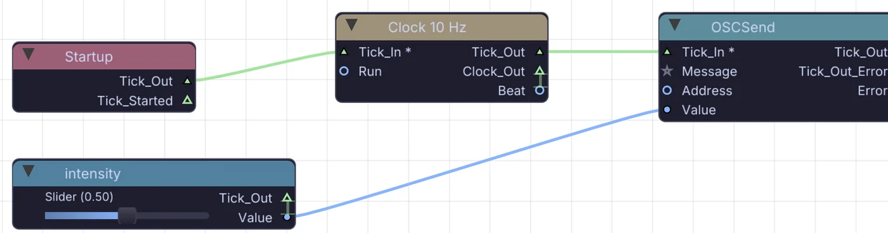

### DMX lighting and show control

DMX covers the full console workflow: patch, programmer, cuelists, palettes, groups, submasters, macros, and a command line. Output goes over Art-Net, sACN with per-address priority, or a serial Enttec adapter, and RDM handles discovery, addressing, and sensors, including tunneling over Art-Net. The fixture library has more than 1,600 profiles.

MVR scene files round-trip patch and 3D position with consoles and visualizers. Cuelists chase SMPTE LTC or Art-Net timecode, ImageToDmx pixel-maps onto fixture positions, and a scheduler fires on clock, sunrise, or sunset. Console-bridge clients target ETC Eos, grandMA3, and Hog 4, and camera tracking arrives over FreeD and PosiStageNet.

`DMX` · `Art-Net` · `ArtPoll` · `sACN` · `E1.31` · `per-address priority` · `RDM` · `RDM tunneling` · `MVR` · `FreeD` · `PosiStageNet` · `Enttec` · `LTC` · `SMPTE timecode` · `pixel mapping` · `cuelist` · `programmer` · `Eos` · `grandMA3` · `Hog 4`

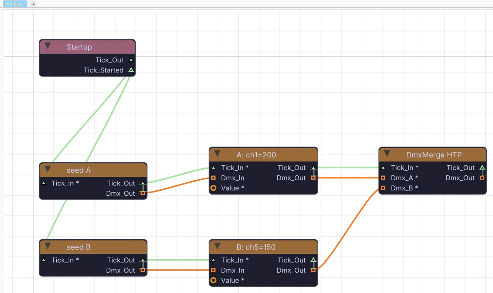

### Projection mapping and warping

Projection mapping covers corner-pin, homography, and mesh warp, plus a Kantan-style mapper you paint shapes in. ProjectorLayout slices a canvas across two to eight projectors with overlap, and ImageEdgeBlend ramps the seams. Structured-light and radiometric calibration scan the surface and emit the UV maps and gain maps so a projected image reads evenly on an uneven, off-axis surface. Any source warps: a 3D render, a shader, or video.

`projection mapping` · `corner pin` · `homography` · `mesh warp` · `Kantan` · `edge blend` · `structured light` · `radiometric calibration` · `gain map` · `multi-projector`

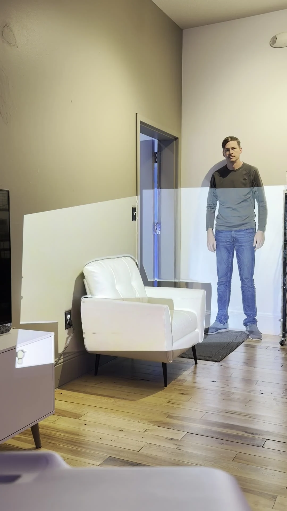 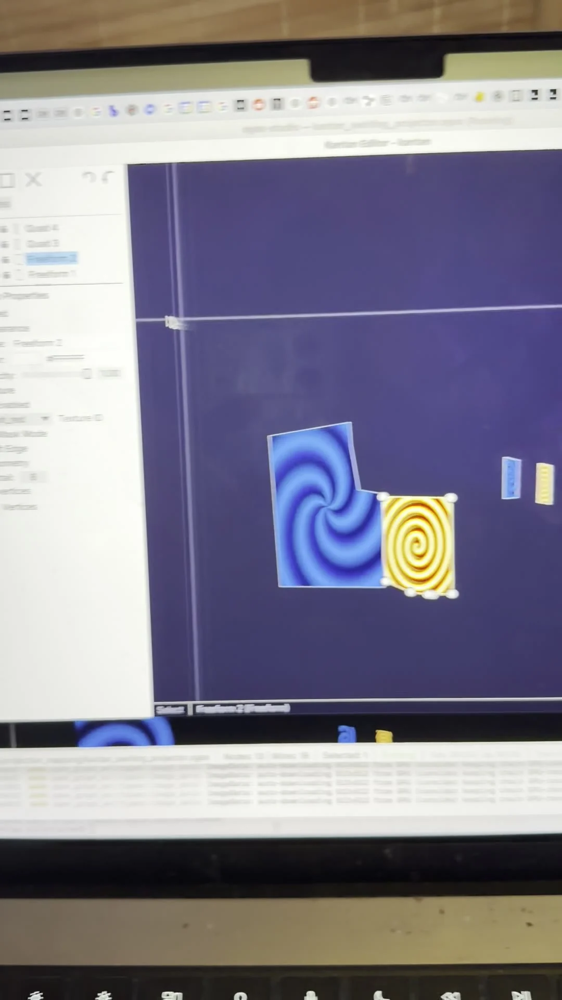

### NDI, Syphon, and pro AV streaming

Streaming splits into NDI send and receive with discovery, Syphon send and receive on macOS, and broadcast out. NDI carries a color-space tag and a quality preset. RTMP encodes H.264 and AAC for YouTube, Twitch, and Facebook; HLS writes MPEG-TS or fragmented MP4 with a rolling playlist; RTSP runs its own server and pulls streams in. Encoding uses Apple VideoToolbox, and the nodes fail loud if it is unavailable rather than sending undecodable video.

A shared tally bus tracks program and preview per source, mirrored from a Blackmagic ATEM or vMix. PTZ control drives pan, tilt, and zoom over NDI, VISCA-IP, or ONVIF, and an Elgato Stream Deck (or a MIDI controller standing in as one) maps buttons to graph actions with LED tally. HTTP, WebSocket, webhook, and serial nodes round out the live I/O.

`NDI` · `Syphon` · `RTMP` · `RTSP` · `HLS` · `MPEG-TS` · `fragmented MP4` · `H.264` · `AAC` · `VideoToolbox` · `adaptive bitrate` · `ATEM` · `vMix` · `Stream Deck` · `VISCA-IP` · `ONVIF` · `tally`

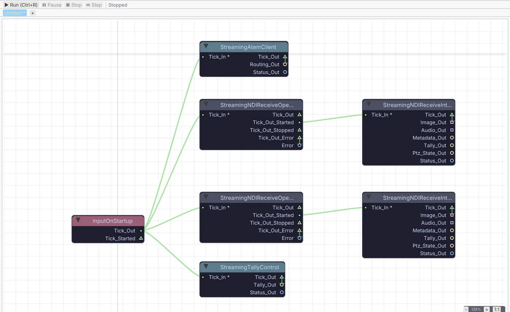

### Camera, depth, tracking, and vision

Blob tracking detects and tracks with stable IDs across frames, four detection modes, occlusion recovery, and zone enter/exit/dwell events. ImageOpticalFlow computes per-pixel motion to drive motion blur and warps, and there are corner, contour, connected-component, and template-match nodes alongside.

Depth, pose, hand, face, and segmentation models run locally on the machine (Metal, CUDA, or CPU), not over a network. Depth Anything turns a single image into a depth map and then geometry; pose finds 17 body keypoints, hands find 21 landmarks, faces find 68; and Segment Anything cuts objects out by prompt, grid, or click. Each emits a typed table per detection, so results feed particles, lights, and parameter mappings. Webcam, video files, and screen or window capture are the input sources.

`computer vision` · `blob tracking` · `track ID` · `MOG2` · `optical flow` · `Lucas-Kanade` · `connected components` · `Harris corner` · `template matching` · `depth estimation` · `Depth Anything` · `point cloud` · `pose estimation` · `YOLOv8` · `hand tracking` · `BlazePalm` · `face landmarks` · `Segment Anything` · `webcam` · `screen capture`

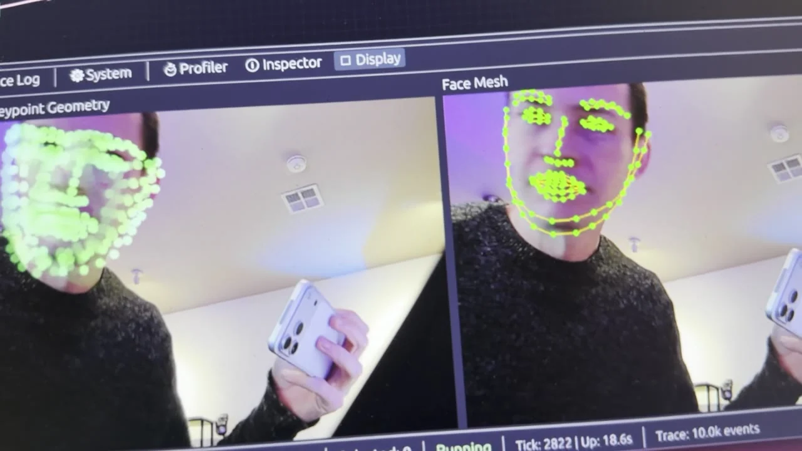 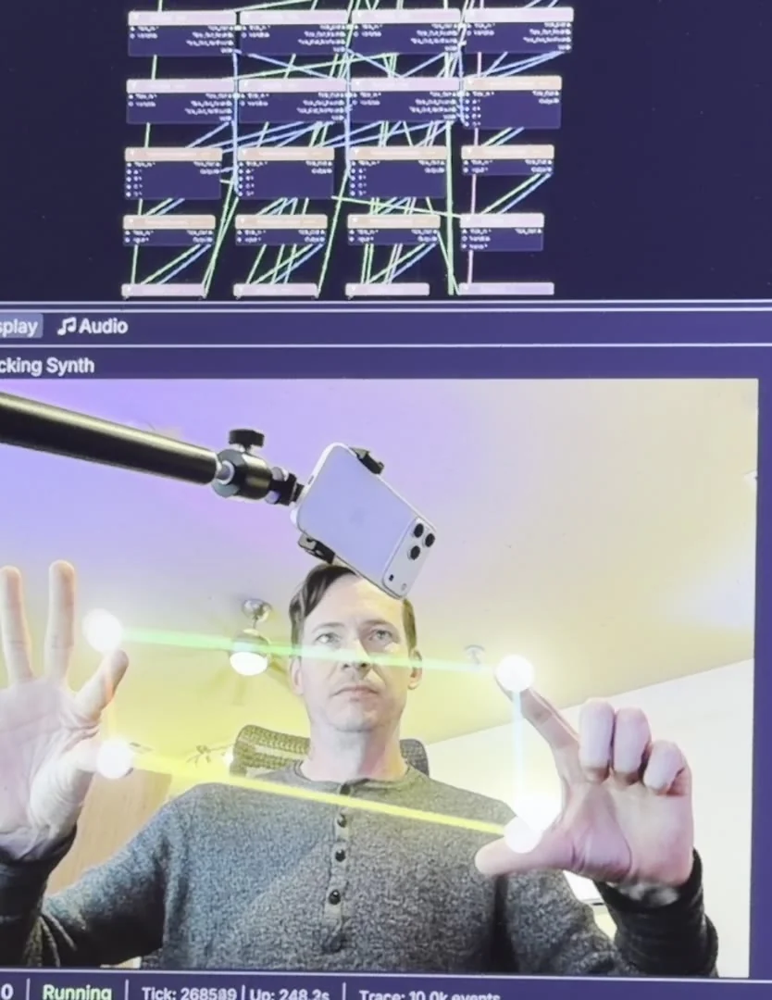

### Scripting: Python and JavaScript

The studio embeds CPython, bundled, so there is nothing to install on the target machine. Four node types run Python in the graph: a full script class with typed ports, a one-expression node, a generator, and a callback. Each keeps its ports and config and swaps back in cleanly after a syntax error.

A multi-tab editor has highlighting, completion against the ogex module, and a real debugger with breakpoints, stepping, and watches across every Python node at once. A docked console is a REPL against the live graph, and a Packages window front-ends pip on a bundled virtualenv. The ogex module spans submodules from ogex.audio and ogex.midi to ogex.geo, ogex.shader, and ogex.ui, with an in-app API reference. JavaScript also runs, sandboxed, through the pure-Rust boa engine.

`Python` · `PythonScriptNode` · `embedded interpreter` · `CPython` · `REPL` · `debugger` · `breakpoint` · `watch expression` · `code completion` · `headless rendering` · `JavaScript` · `boa_engine` · `sandboxed scripting`

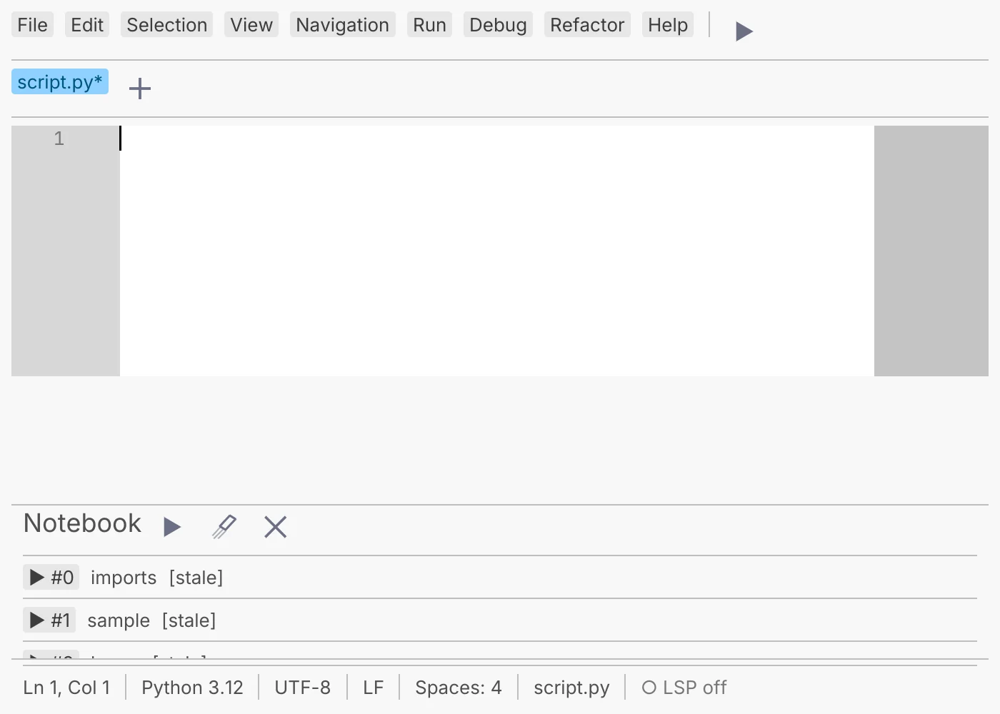 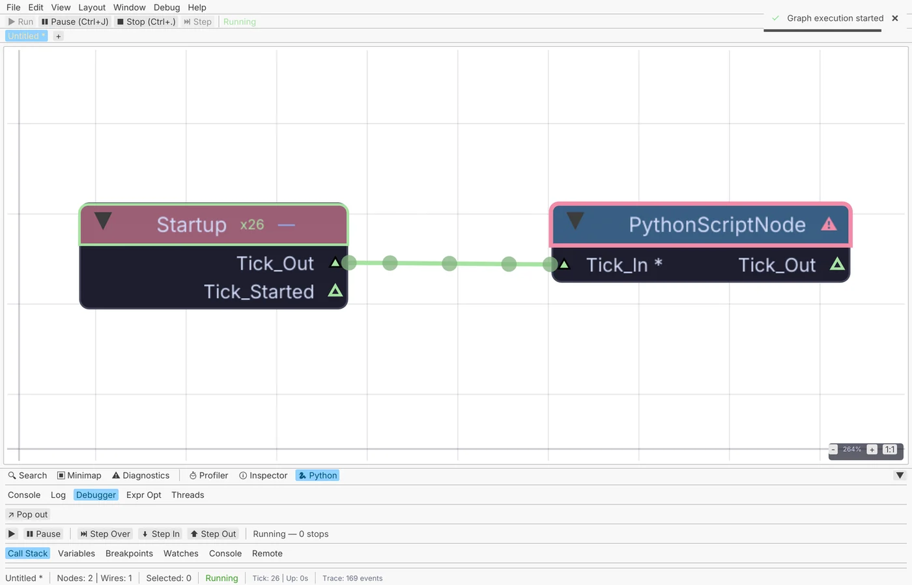

### Control surfaces and UI widgets

The UI nodes are on-canvas control widgets and displays: sliders, dials, XY pads, a joystick, toggles, an onscreen keyboard, plus gauges, meters, a spectrum analyzer, and scope displays. Editor widgets live-edit structured data and save it in the graph: a Bezier curve editor, an ADSR envelope, gradient and color pickers, a step sequencer, a filter designer, a spectrum you paint and inverse-FFT to audio, and a PBR material editor. Widgets group into popout panels and bind to MIDI or OSC with Learn.

`UI widget` · `control surface` · `slider` · `dial` · `XY pad` · `joystick` · `color picker` · `gauge` · `level meter` · `spectrum analyzer` · `curve editor` · `ADSR envelope` · `step sequencer` · `Stream Deck` · `parameter mapping`

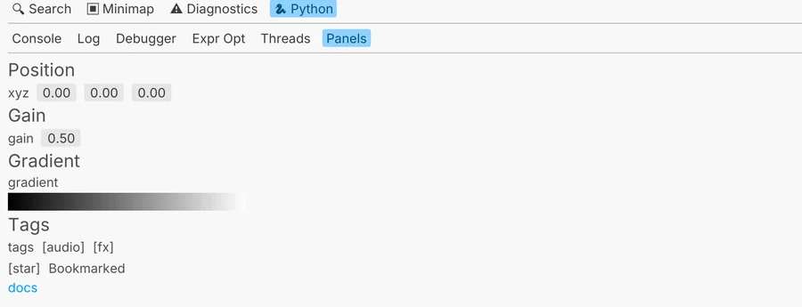 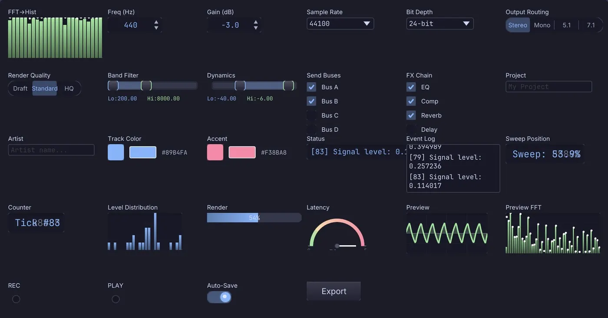

## The studio

### Canvas, palette, and wiring

The canvas has type-colored nodes, port pins, and wires drawn in the color of the data passing through them. Space or double-click opens quick-add, filtered as you type. Drag from a pin and compatible inputs highlight; drop on a node and it auto-routes, drop on empty canvas and you get a menu of nodes that fit. There is a three-pane palette, box-select, the usual align, distribute, and snap actions, a minimap, and numbered viewport bookmarks.

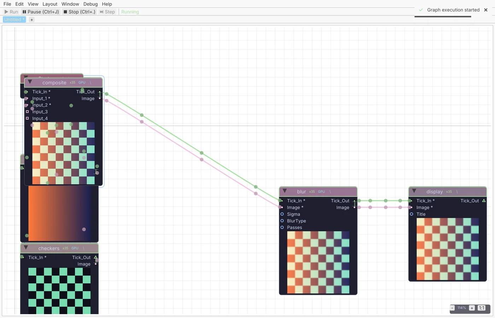

### Inspector, drivers, and undo

The Properties panel edits a node's config with the right widget per type, min/max/step enforcement, conditional fields, and validation badges. The Inspector adds Watches that pin a node, port, or wire and show live values and execution stats.

Any parameter can be driven by an expression that re-evaluates every tick: a Fast compiled driver (about a microsecond, stored with a leading `#`) with time, frame, sin, clamp, lerp, channel, and osc, or a Python driver (`@`). The editor previews the curve at t=0, 0.5, and 1.0, and a driven field shows its live value in amber. Every change emits a record, so canvas edits and Python mutations both undo with Cmd+Z; a search panel and a Cmd+Shift+P command palette round it out.

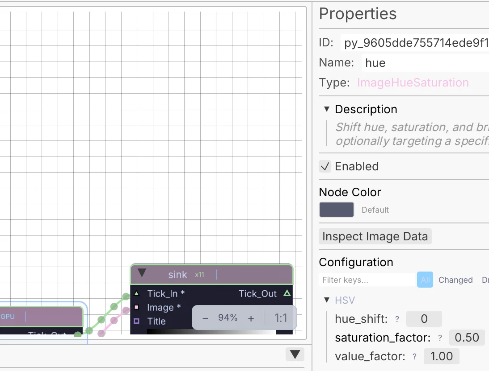

### Components and the .ogex file

A Component wraps a subgraph as one node with its own ports. Double-click to step inside, breadcrumb back out, and bridge nodes define the port surface across every type from Tick to Geometry and Scene. The Public Property Editor picks which parameters the Component exposes.

Graphs save as plain JSON in the .ogex format: one array of nodes and links, human-readable and git-diffable. Studio writes a sibling `_editor` block for positions, colors, and groups that the engine ignores and round-trips, so logic and layout stay decoupled. Optional `network` and `transport` blocks carry streaming NIC roles and project tempo with the file.

### Editor windows

OGEX opens dedicated editor windows on specific nodes. Each reads its node live and writes every edit back through the normal path, so changes from Python, OSC, or hardware show up without a refresh, travel in the .ogex, and undo. Nothing saves on close.

- **DMX console.** Eleven windows for the lighting workflow: Patch Table, Cuelist, Programmer, Master Live, Palette and Submaster pools, Magic Sheet with PNG export, Surface Layout, Personality Editor, Pixel Matrix, and RDM Discovery.
- **MIDI.** A Piano Roll with velocity and CC lanes and recording, plus Clips, Transport, Devices, Monitor, Routing Matrix, Profile Library and editor, Controller Surface, Patch Librarian, SysEx editor, Song/Setlist, and Push Surface.
- **OSC and Ableton.** An OSC Monitor, Namespace and OSCQuery browsers, Mappings, and Learn; plus an Ableton Live Companion mirroring Live's session view, with Scenes, Cue Points, Sends, and a Device inspector on one connection.
- **Streaming.** A Sources window of live thumbnails you drag onto the canvas as a wired receive chain, a Tally Master, a PTZ Controller, a Stream Deck Layout, Network Settings, and a Network Status window with per-NIC and per-stream tables and a PTP block.
- **Visual editors.** A shader editor with auto-compile, completion, and inline error squiggles mapped to your source; a Compositor; the Kantan mapper; a keyframe editor; and a video timeline with V/A clips, transitions, render to file, and EDL and SRT export.
- **Inspectors.** An orbit viewport for geometry, scenes, and materials with a scene tree and attribute spreadsheet; a material preview under several HDRIs; an SDF and volume ray-marcher; and a heightfield sampler.

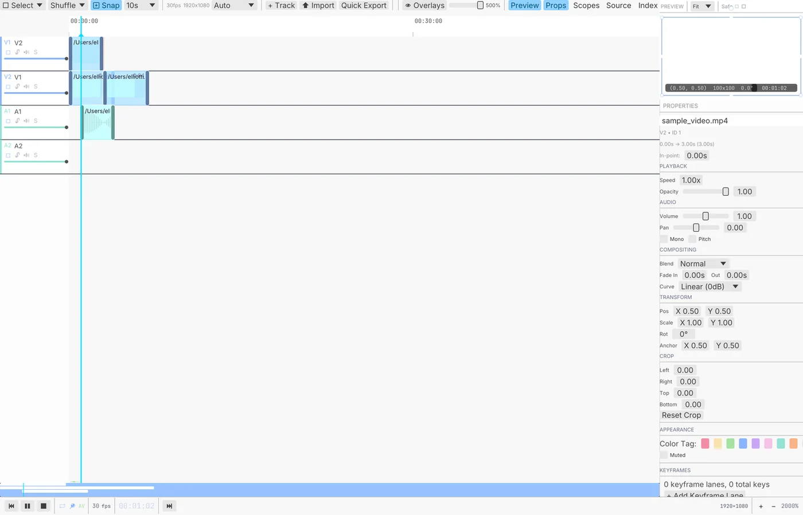

### Diagnostics and preferences

A Diagnostics panel collects lint and validation results with Console, Change Log, and Statistics tabs. A Profiler shows per-node executor cost with CSV export, and a System Monitor sparklines CPU, RAM, and GPU. Preferences cover devices, models, and Python. Four Catppuccin themes are built in, with a colorblind-safe mode and a night mode for dark venues. The top bar holds transport (Run, Pause, Stop, Step), a tick-rate readout, and a compute-device chip.

## What you can build

- Live concert and club visuals that follow the music over MIDI, OSC, or Ableton Live.
- Museum and gallery installations driven by cameras, depth sensors, and hand tracking.
- Projection-mapped stage sets, domes, and sculptures.
- DMX lighting rigs and LED walls. The console windows, fixture library, and timecode chase run in the same graph as the visuals.
- Generative art and motion pieces from shaders, particles, geometry, and terrain.
- Broadcast and streaming pipelines with NDI, Syphon, RTMP, and tally.

## Requirements and status

- macOS 11 (Big Sur) or later, Apple Silicon (M-series). This release is a macOS binary.
- The build is signed with a Developer ID and notarized by Apple.
- Graphs are JSON and run in OGEX, or through the Python library.

macOS is the only download for now. A Linux build is coming soon, and Windows is in the works.

## Links

- Website and gallery: https://ogex.app
- Features: https://ogex.app/features
- Showreel: https://www.youtube.com/watch?v=JXA2xRo9f88

---

Keywords: node-based visual programming, dataflow, creative coding, live visuals, VJ software, generative art, TouchDesigner alternative, Max/MSP, vvvv, Notch, live graphics node editor, GPU particles, WGSL, GLSL, Shadertoy, shader live coding, PBR rendering, XPBD cloth simulation, soft body physics, rigid body dynamics, SDF, NURBS, procedural geometry, terrain generation, DMX, Art-Net, sACN, lighting control, projection mapping, NDI, Syphon, RTMP, OSC, Ableton Live, MIDI router, RTP-MIDI, MPE, sequencer, computer vision, face tracking, hand tracking, depth camera, interactive installation, macOS, Apple Silicon.
