

# OGEX

### A node-based engine for live graphics, audio, lighting, and interactive media on macOS, Windows, Linux, and Raspberry Pi.

[**macOS**](https://get.ogex.app/OGEX-0.4.6.dmg) · [**Windows**](https://get.ogex.app/OGEX-0.4.6-windows-x86_64-setup.exe) · [**Linux**](https://get.ogex.app/ogex_0.4.6-0_amd64.deb) · [**Raspberry Pi**](https://get.ogex.app/ogex_0.4.6-0_arm64.deb) · [Features](https://ogex.app/features)

---

OGEX is a node graph engine for building live visuals and interactive systems. You drag boxes onto a canvas, wire them together, and data flows through the graph. Each box does one job. A webcam, a blur, a shader, a particle emitter, a DMX universe. Wire them up and the picture updates while you drag a slider. There is no compile step and no render-and-wait.

If you have used TouchDesigner, Max/MSP, vvvv, Notch, or Houdini, the node-graph idea will feel familiar. One graph drives everything described below: 3D rendering, shaders, geometry, splats, simulation, audio, MIDI, OSC, DMX lighting, NDI, and projection mapping.

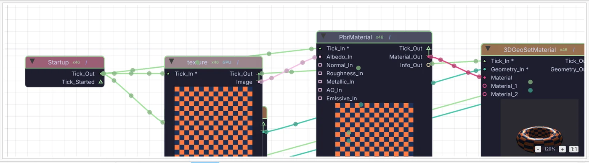

## Download

This repository is the binary release. Each platform is updated on its own schedule, so the latest version can differ between them. Right now every platform is on 0.4.6.

| Platform | Version | Download | Size |
|---|---|---|---|
| macOS, Apple Silicon | 0.4.6 | [OGEX-0.4.6.dmg](https://get.ogex.app/OGEX-0.4.6.dmg) | 532 MB |
| Windows, x64 | 0.4.6 | [OGEX-0.4.6-windows-x86_64-setup.exe](https://get.ogex.app/OGEX-0.4.6-windows-x86_64-setup.exe) | 1.03 GB |
| Linux, x86_64 (deb) | 0.4.6 | [ogex_0.4.6-0_amd64.deb](https://get.ogex.app/ogex_0.4.6-0_amd64.deb) | 1.05 GB |
| Linux, x86_64 (tar.gz) | 0.4.6 | [ogex-0.4.6-linux-x86_64.tar.gz](https://get.ogex.app/ogex-0.4.6-linux-x86_64.tar.gz) | 1.32 GB |
| Raspberry Pi 5 and Linux arm64 (deb) | 0.4.6 | [ogex_0.4.6-0_arm64.deb](https://get.ogex.app/ogex_0.4.6-0_arm64.deb) | 479 MB |
| Raspberry Pi 5 and Linux arm64 (tar.gz) | 0.4.6 | [ogex-0.4.6-linux-aarch64.tar.gz](https://get.ogex.app/ogex-0.4.6-linux-aarch64.tar.gz) | 591 MB |

**macOS.** Open the DMG and drag OGEX to Applications. It is signed with a Developer ID and notarized by Apple, so it opens normally.

**Windows.** Run the installer. It is code signed, with Elliot Turner as the publisher. A new release can still get a SmartScreen warning for its first few days; if it does, choose More info, then Run anyway. The installer also puts the Visual C++ runtime in place if your machine does not already have it.

**Linux.** Install the deb with `sudo apt install ./ogex_0.4.6-0_amd64.deb`, or unpack the tar.gz anywhere and run `usr/bin/ogex-studio` from inside the extracted `ogex-<version>-linux-<arch>` folder.

**Raspberry Pi.** The arm64 build is made on a Pi 5 running 64-bit Raspberry Pi OS, and installs the same way as the Linux build. It also runs on other arm64 Linux machines.

Graphs save as plain JSON, so your projects are portable and easy to keep in version control.

## What is inside

### 3D rendering and PBR materials

Rendering runs on the GPU through Vulkan, with a CPU path as backup, and each render node has its own GPU/CPU switch. There are nine material types: PbrMaterial does the full metal-roughness look with parallax height, and the rest cover Phong, unlit, wireframe, depth, lines, point sprites, a shadow catcher for dropping CG onto live footage, and ShaderMaterial for your own WGSL or GLSL. Triplanar projection lives on the material create and update nodes.

Up to 64 lights, with soft shadows on 8 of them. Drop in an HDRI and the image-based lighting is worked out once and kept; a cubemap probe handles live reflections. Cameras go from plain perspective to fisheye and a custom projection matrix. Anti-aliasing is SSAA, MSAA, or TAA, and tone mapping is ACES, ACES 2.0, AgX, PBR Neutral, or Reinhard. Bloom, ambient occlusion, and depth of field are separate image nodes you hang off the render. Repeated objects draw as instances, and geometry stays on the GPU between frames. Import covers OBJ, glTF, FBX, USD, Alembic, PLY, and STL.

`PBR` · `Cook-Torrance GGX` · `Blinn-Phong` · `metallic-roughness` · `shadow mapping` · `PCF soft shadows` · `image-based lighting` · `IBL` · `HDRI` · `shadow catcher` · `SSAA` · `MSAA` · `TAA` · `fisheye camera` · `tone mapping` · `ACES` · `AgX` · `glTF` · `USD` · `Alembic`

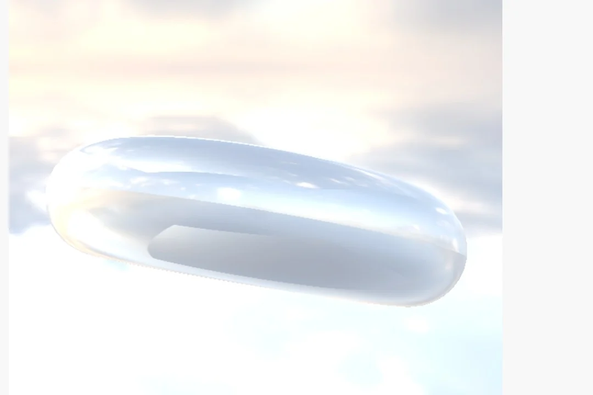

### Custom shaders (WGSL, GLSL, Shadertoy)

Write WGSL or GLSL right in the node and it recompiles as you type, with errors pointing at your own line numbers. ImageShader works on images: up to 8 inputs, 7 outputs, and up to 64 passes per frame, so blur stacks and feedback need no wired loop. ShaderMaterial is your own vertex and fragment material, and falls back to plain PBR if it fails to compile. AttributeShader runs over geometry, once per point, corner, or face.

Uniforms show up as sliders you can drive live, and `#include` libraries give you noise, lighting, SDF, color, and Shadertoy helpers. Turn on `shadertoy_compat` and a classic `mainImage` shader comes across with small edits. A bad edit keeps the last working shader on screen and flags the error, so you never lose your output mid-show. The Material Inspector's Dump Source button turns a PbrMaterial into an editable ShaderMaterial to start from.

`WGSL` · `GLSL` · `Shadertoy` · `compute shader` · `fragment shader` · `vertex shader` · `multi-pass` · `multiple render targets` · `specialization constants` · `vertex skinning` · `shader hot reload`

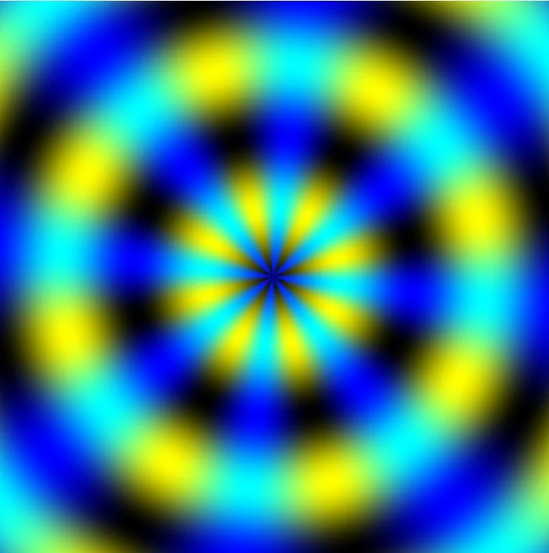

### Image processing and compositing

The Image nodes cover grading, filters, compositing, distortion, and stylize. Grading has lift/gamma/gain, curves, LUTs, white balance, histogram match, and tone mapping, with color-space conversion across RGB, HSV, HSL, Lab, YUV, XYZ, ACES, Rec.2020, and Display P3. ImageOpenColorIO applies an OCIO config, so OGEX can sit in a studio color pipeline. ImageBlur has nine kernels, plus dedicated bilateral, kuwahara, bokeh, and tilt-shift nodes, and edge detection runs from sobel to canny.

Compositing layers with real blend modes: ImageAlphaOver has 31, ImageComposite 47, alongside chroma and luma key, difference matte, and depth compositing. Distortion covers lens distort, chromatic aberration, kaleidoscope, swirl, pixel-sort, slit-scan, and UV remap, and the time-based nodes do feedback, frame delay, trails, and time warp. Image chains run on the GPU, in 8-bit or 32-bit float, and nearly every image node has a GPU/CPU switch.

`color grading` · `OpenColorIO` · `OCIO` · `Gaussian blur` · `convolution kernel` · `chroma key` · `luma key` · `blend modes` · `CLAHE` · `LUT` · `lens distortion` · `chromatic aberration` · `kaleidoscope` · `pixel sort` · `slit scan` · `Canny` · `premultiply`

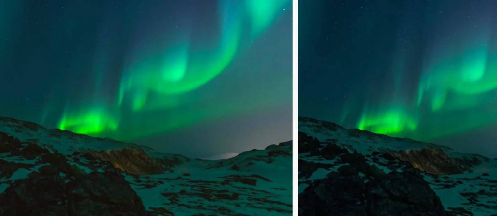

### Image generators and procedural textures

Image generators need nothing wired in; they build from their own settings. ImageNoiseGen covers Perlin, simplex, worley, and ten other noise types, ImageMandelbrot renders Mandelbrot and Julia with deep zoom, and ImageVoronoi scatters cells. ImageReactionDiffusion grows spots, stripes, and labyrinths from 40 presets, and its feed, kill, and diffusion can each be painted per pixel by another image chain. ImageCellularAutomaton runs Life, WireWorld, and your own rules.

Pattern and texture generators make bricks, hex tiles, Truchet, checker, gradients, woven canvas, cracked mud, Chladni figures, and caustics. ImageSimpleExpression runs a math expression on every pixel for masks and channel mixing, without writing a full shader.

`procedural noise` · `Perlin` · `simplex` · `worley` · `Voronoi` · `Mandelbrot` · `Julia` · `reaction diffusion` · `Gray-Scott` · `cellular automaton` · `Conway's Life` · `Truchet` · `Chladni` · `phasor noise` · `gradient generator` · `SMPTE bars`

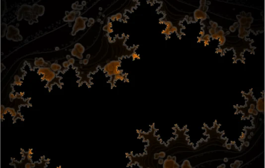 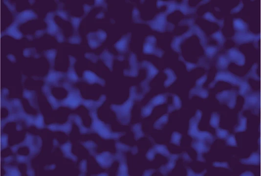

### Geometry, NURBS, and signed distance fields

The procedural modeling nodes carry the 3DGeo prefix. You get the usual primitives, boolean CSG that can tag the cut seam, Catmull-Clark and Loop subdivision, and adaptive remeshing. Deformers run bend, twist, taper, lattice, delta mush, shrinkwrap, and a couple dozen more, plus Voronoi fracture, L-systems, and metaball and marching-cubes surfacing. Topology, UV, and instancing tools round it out, and a 36-node attribute family creates, transfers, blurs, and randomizes point and face data. Import and export both cover OBJ, FBX, glTF, PLY, STL, USD, and Alembic.

NURBS curves and surfaces revolve, sweep, loft, trim, fillet, and intersect for CAD-style modeling. Signed distance fields travel as volumes: build SDF primitives up to 512 voxels a side, smooth-blend them, turn a mesh into a field or a field back into a mesh, and shell, roughen, and repeat them along the way. On the image side, TextSDF renders text as a distance field that stays sharp at any size.

`procedural geometry` · `boolean CSG` · `Catmull-Clark` · `remesh` · `Voronoi fracture` · `metaball` · `marching cubes` · `L-system` · `lattice deform` · `delta mush` · `pelt unwrap` · `NURBS` · `B-spline` · `loft` · `revolve` · `SDF` · `signed distance field` · `smooth boolean` · `voxel`

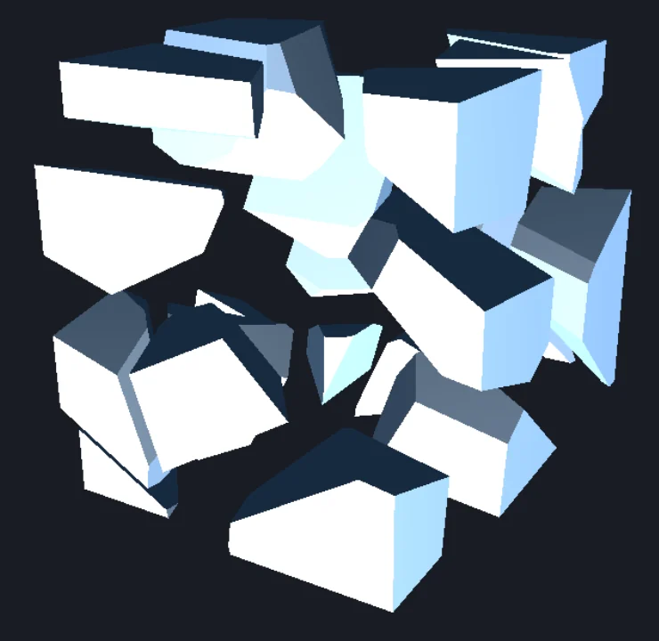 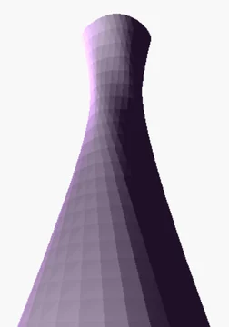 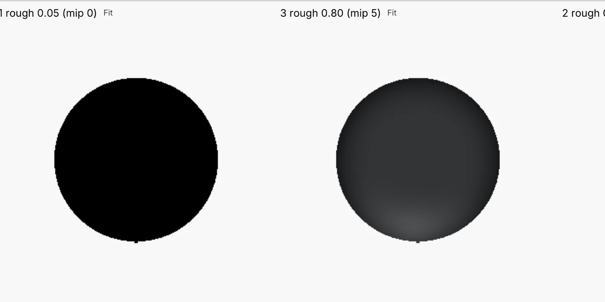

### Gaussian splats

Splats are first-class geometry. Import captured scenes from PLY, SPZ, SOG, SPLAT, and KSPLAT files, then crop, prune, thin, align, and color-match them, deform them with cages and fields, and relight them with PBR lighting and shadows. Splats can be skinned to a rig, turned into meshes or volumes, grown from a mesh, and exported again. 3DGeoSplatKernel runs your own per-splat shader code.

`Gaussian splatting` · `3DGS` · `splat` · `SPZ` · `SOG` · `KSPLAT` · `point cloud` · `splat relighting` · `splat to mesh`

### Rigging, character animation, and motion capture

The rig nodes build a skeleton, paint and bind skin weights, and pose with two-bone and full-body IK. Load animation clips from glTF, VRM, FBX, BVH, and USD, retarget them between characters, and blend and sequence them. Ragdolls, secondary motion like jiggle and follow-through, blendshapes, and AudioToFace (a voice track drives the mouth) are all nodes too.

Live motion capture comes in over VMC, Live Link Face, iFacialMocap, and VTube Studio, so a suit or a phone can drive a character while the show runs, and the Mocap window records takes. Optical marker data loads from C3D files exported by Vicon, Qualisys, and OptiTrack and solves onto a skeleton.

`rigging` · `skinning` · `weight paint` · `inverse kinematics` · `full-body IK` · `retargeting` · `BVH` · `VRM` · `ragdoll` · `blendshapes` · `motion capture` · `VMC` · `Live Link Face` · `C3D` · `Vicon` · `OptiTrack`

### GPU particles

Particles carry the 3DGeoParticle prefix and scale to 10 million live. There are two ways to build them. The simple emitter births, moves, and kills particles in one node, for quick emit-to-render graphs. The chain emitter splits birth, forces, and motion into separate nodes, so you stack force nodes (wind, vortex, attract, orbit, flocking, drag, spin, and more) and a solver moves everything. Collision bounces, slides, or sticks particles off planes, boxes, spheres, cylinders, and meshes.

Render them as instanced geometry, ribbons, trails, or sprites. Split, group, and spawn-on-event nodes make sparks and debris, and per-particle color ramps, texture lookups, and expressions style the look.

`GPU particles` · `particle emitter` · `chain solver` · `flocking` · `boids` · `vortex` · `attractor` · `point sprites` · `ribbon` · `trail` · `substeps` · `particle collision` · `color ramp`

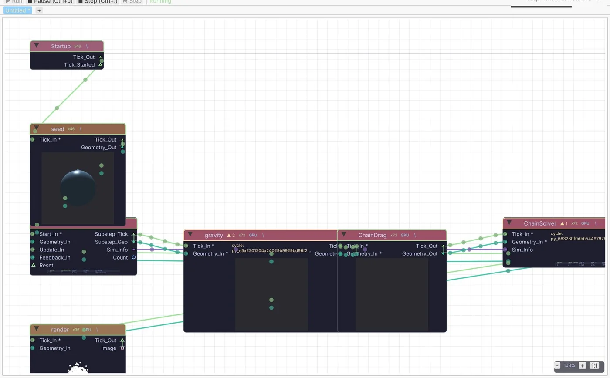 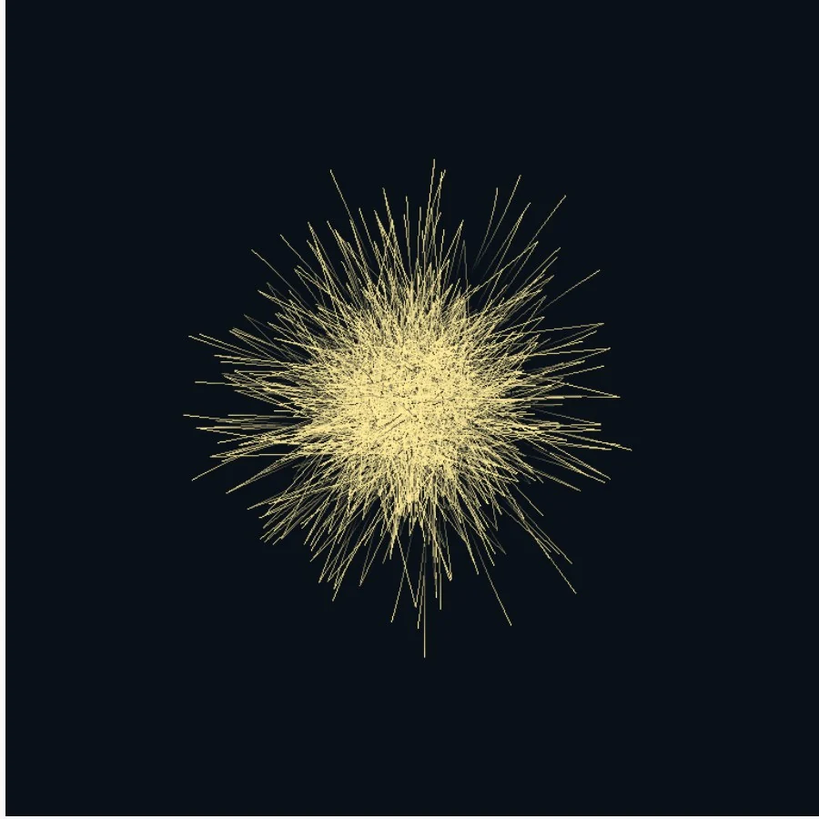

### Smoke, fire, and liquids

The 3DGeoFluid nodes simulate smoke, fire, and explosions on the GPU: emit density and heat, stack forces like buoyancy, wind, turbulence, and vortices, burn fuel into flame, and render the result as a lit volume or cache it to disk. 3DGeoFluidSimpleSolver wraps a whole setup in one node with presets such as flames, with every setting on one panel.

The 3DGeoFlip nodes do liquids: splashing water with whitewater spray and foam, viscous goo, surface tension, ocean waves, and liquid that pushes rigid bodies around and is pushed back, then mesh the surface for rendering.

`fluid simulation` · `smoke simulation` · `fire simulation` · `pyro` · `volume rendering` · `FLIP` · `liquid simulation` · `whitewater` · `ocean spectrum` · `viscosity`

### Physics: soft bodies, cloth, and rigid bodies

Two engines. PBDSim is a position-based solver for the soft stuff: cloth, hair, soft bodies, grain, inflatables, and particle fluids. You don't wire its constraints by hand. A recipe node takes a mesh or some curves and builds the setup for you, one each for cloth, hair, grain, softbody, balloon, fluid, and a stuffed-animal preset that keeps its overall shape. Cloth tears and stays bent. Soft bodies fill with tetrahedra to hold their volume, or hang on struts cast through a shell. Balloons hold their air. When you want the constraints in your own hands, PBDSimConstraints offers all 17 types. PBDSimSolverFrameRange bakes a whole run in one go, and PBDSimIO caches it to disk for smooth playback.

The Physics nodes are a separate rigid-body engine. PhysicsWorld sets gravity and the timestep, in 2D or 3D. PhysicsBody covers moving, fixed, and animated bodies in the usual shapes, from boxes through convex hulls to full meshes. PhysicsConstraint has the standard joints (fixed, hinge, slider, ball, spring, rope), each with a break threshold so it snaps under load. PhysicsMotor drives a joint, PhysicsGlueConstraint holds pieces together until they crack apart and spreads the break to their neighbors, and PhysicsRaycast reports what it hit. PhysicsExtractTransforms hands every body's position to an instancer, and PhysicsDebugRender draws the shapes and contacts as wireframe.

`XPBD` · `position-based dynamics` · `cloth simulation` · `soft body` · `tetrahedral` · `hair simulation` · `grain` · `pressure constraint` · `shape matching` · `rigid body dynamics` · `joints` · `motor` · `fracture` · `glue constraint` · `raycast` · `continuous collision detection`

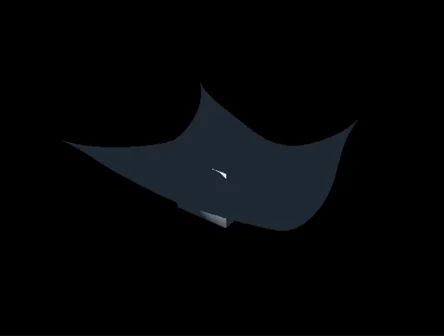 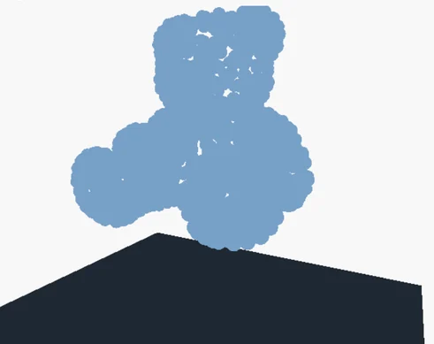 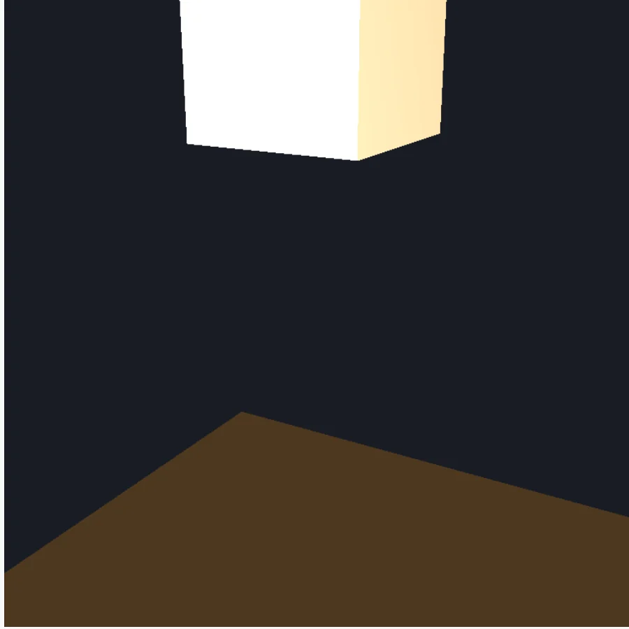

### Procedural terrain

Terrain starts as a heightfield: a 2D grid that is cheap to push around before it becomes a mesh. Erosion comes in eight flavors (hydraulic, thermal, wind, glacial, coastal, rainfall, and two general-purpose passes), river carving pairs with tectonic uplift to raise mountains, and the hydrology nodes map drainage, flow, and stream order. Terracing, masks by slope and height, warping, and even-spaced scatter handle the shaping and the prop placement.

Export goes straight to game engines: a 16-bit heightmap with 8-bit layer weights in the Unreal Landscape layout, Unity RAW16 plus splat maps, or chunked OBJ and FBX. One graph can feed Unreal and Unity at once.

`heightfield` · `terrain generation` · `hydraulic erosion` · `thermal erosion` · `glacial erosion` · `stream power` · `tectonic uplift` · `Strahler` · `terrace` · `domain warp` · `slope mask` · `Poisson disk` · `Unreal Landscape` · `Unity terrain` · `RAW16` · `splatmap`

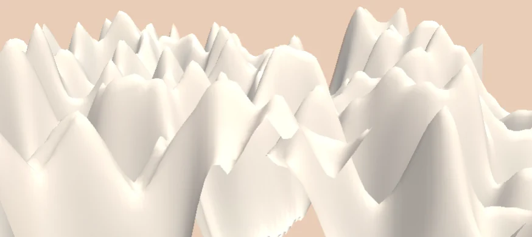 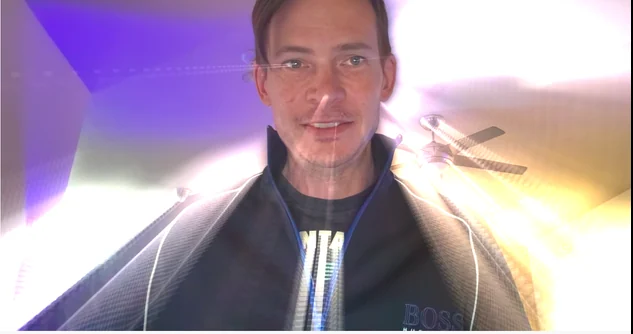

### Audio synthesis, analysis, and plugins

The audio nodes carry the Audio prefix and cover synthesis, analysis, effects, and a plugin host. Synthesis runs oscillators, FM, wavetable, granular, Karplus-Strong, and modal and waveguide physical models. Analysis reports FFT, spectrum, BPM and onsets, pitch, key and chord, and broadcast loudness (LUFS). Filters and dynamics are the full set, from ladder and state-variable filters to compressors, limiters, and transient shapers.

Effects cover reverb (plate, spring, convolution), delays, chorus, phaser, distortion, pitch shift, time stretch, and a vocoder, plus ambisonic encode and decode for surround. PluginHost loads CLAP and VST3 plugins, plus LV2 on Linux, with the plugin's own window, and can run a plugin in its own process so a crash can't take the studio down. Audio goes in and out through your system's audio devices on every platform.

`FM synthesis` · `wavetable` · `granular` · `Karplus-Strong` · `modal synthesis` · `waveguide` · `FFT` · `STFT` · `vocoder` · `convolution reverb` · `LUFS` · `pitch detection` · `beat tracking` · `ladder filter` · `parametric EQ` · `transient shaper` · `ambisonics` · `CLAP` · `VST3` · `LV2`

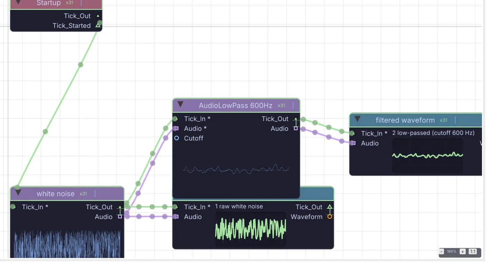

### Channel Data

Channel Data is a bundle of named control signals moving through the graph. Its nodes do math, logic, smoothing, LFOs, patterns, and expressions, and converters bridge it to and from audio, MIDI, geometry, images, and JSON, and out to DMX. So an FFT band or a beat detector can drive DMX channels, MIDI notes, or geometry without leaving the graph. OSC and file nodes move channels in and out.

`channel data` · `control signal` · `audio to MIDI` · `audio to DMX` · `OSC channels` · `signal conversion`

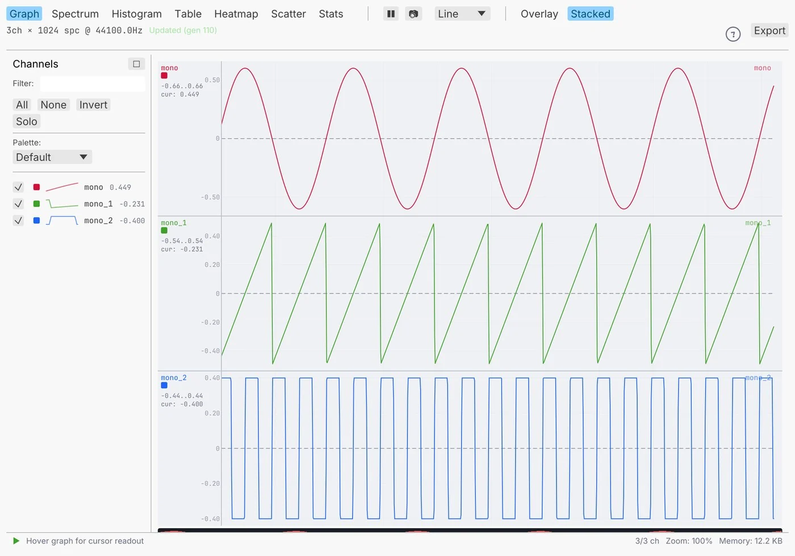

### MIDI: routing, clock, sequencers, and network MIDI

MIDI handles notes, CC, pitch bend, pressure, RPN/NRPN, SysEx, and timecode, in and out. Routing covers merge, router, channel map, keyboard split, and thru. MPE reads per-note pitch, pressure, and timbre from the Roli Seaboard, LinnStrument, and Haken Continuum. Network MIDI runs over RTP-MIDI (AppleMIDI) and ipMIDI. Clock nodes divide, multiply, smooth, and tap tempo, and the sequencers cover Euclidean, step, and pattern sequencers, an arpeggiator, and piano-roll clip playback, all able to follow a shared project tempo.

Soft takeover, MIDI learn with pickup and curve, and voice allocation with glide handle live control. A patch librarian stores, compares, and steps through a setlist saved in the project, alongside program change, snapshot recall, MIDI Tuning, and MIDI-CI and device-inquiry nodes. The device-profile library comes with nine controllers plus General MIDI. Standard MIDI Files read and write, and converters turn MIDI into channel data or gates, or a monophonic audio line into MIDI notes.

`MIDI` · `RTP-MIDI` · `AppleMIDI` · `ipMIDI` · `MPE` · `Roli Seaboard` · `LinnStrument` · `MIDI-CI` · `NRPN` · `SysEx` · `MIDI Show Control` · `MMC` · `Euclidean sequencer` · `arpeggiator` · `MIDI clock` · `MIDI Learn` · `soft takeover` · `voice allocation` · `patch librarian`

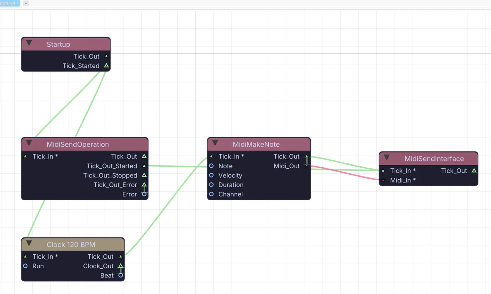

### OSC and Ableton Live

The OSC nodes send, receive, build, and unpack messages and bundles, and convert them to and from numbers, vectors, and tables. OSCRewrite remaps addresses, OSCRecorder captures a stream, and OSCQuery both publishes your parameters and discovers other apps'.

The Ableton nodes drive Live through AbletonOSC: tempo and beat from AbletonLiveLink, reading, setting, and watching any Live property with AbletonLiveControl, clip and scene launching, the clip grid, device parameters, the groove pool, and cue points. PushSurface reads an Ableton Push 2 or 3 over USB and lights its pads.

`OSC` · `Open Sound Control` · `OSCQuery` · `OSC bundle` · `address rewrite` · `Ableton Live` · `AbletonOSC` · `clip launch` · `groove pool` · `cue point` · `Ableton Push` · `Push 2` · `Push 3`

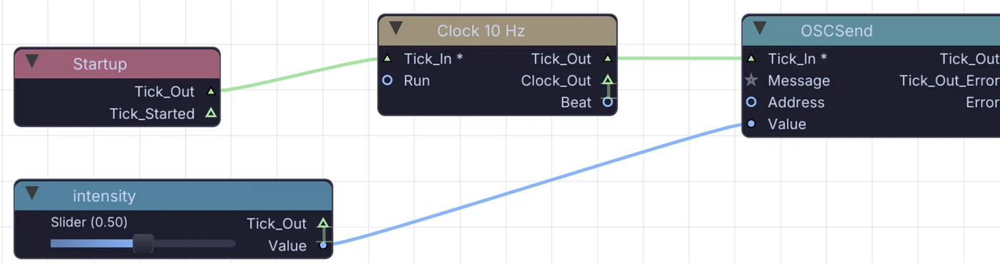

### DMX lighting and show control

DMX covers the full console workflow: patch, programmer, cuelists, palettes, groups, submasters, macros, and a command line. Output goes over Art-Net, sACN with per-address priority, or a USB Enttec interface. RDM finds fixtures, sets their addresses, and reads their sensors, and can reach them over RDMnet. The fixture library has more than 1,600 profiles.

MVR scene files carry the patch and fixture positions to and from consoles and visualizers. Cuelists chase SMPTE LTC or Art-Net timecode, ImageToDmx pixel-maps video onto fixture positions, and a scheduler fires cues by clock, sunrise, or sunset. Console bridges talk to ETC Eos, grandMA3, and Hog 4, and camera tracking comes in over FreeD and PosiStageNet.

`DMX` · `Art-Net` · `ArtPoll` · `sACN` · `E1.31` · `per-address priority` · `RDM` · `RDMnet` · `MVR` · `FreeD` · `PosiStageNet` · `Enttec` · `LTC` · `SMPTE timecode` · `pixel mapping` · `cuelist` · `programmer` · `Eos` · `grandMA3` · `Hog 4`

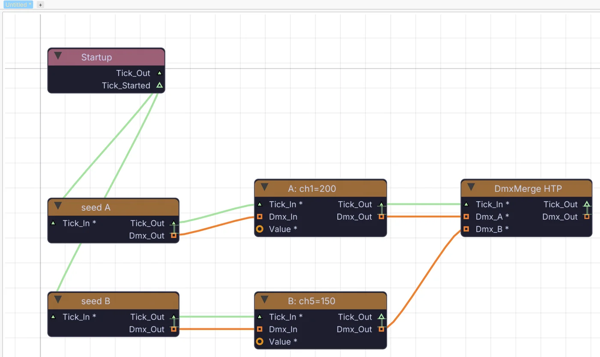

### Projection mapping and warping

Projection mapping covers corner-pin, homography, and grid warp, plus a ProjectionMapper you draw shapes in. ProjectorLayout splits a canvas across a row or column of up to eight projectors, or a grid of up to 16, with overlap, and ImageEdgeBlend fades the seams. Structured-light and brightness calibration scan the surface and hand back the maps that make a projected image land evenly on an uneven, off-angle surface. Any source can be mapped: a 3D render, a shader, or video.

`projection mapping` · `corner pin` · `homography` · `grid warp` · `ProjectionMapper` · `edge blend` · `structured light` · `radiometric calibration` · `gain map` · `multi-projector`

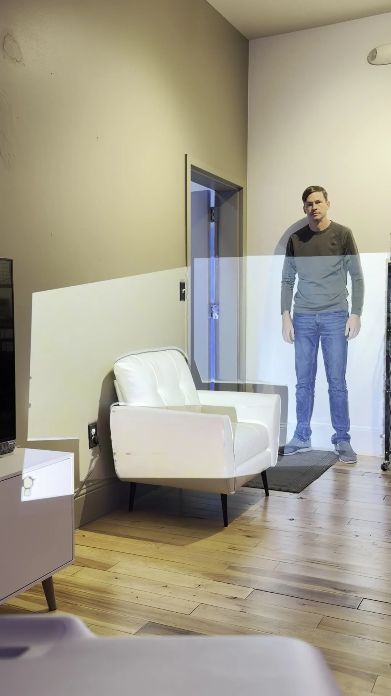 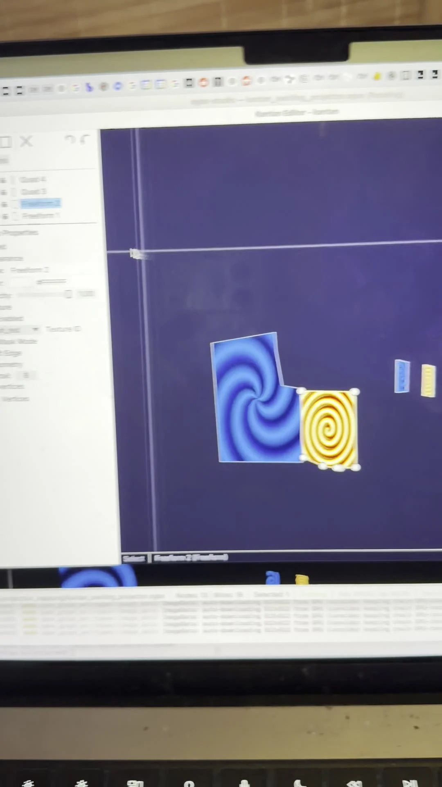

### NDI, Syphon, and streaming

Streaming covers NDI send and receive with source discovery, Syphon send and receive on macOS, and going out live. NDI carries a color-space tag and a quality preset. RTMP sends H.264 and AAC to YouTube, Twitch, and Facebook; HLS writes a rolling playlist; RTSP runs its own server and pulls streams in. Video encodes on your machine's hardware encoder (Apple VideoToolbox on a Mac, NVIDIA, Intel, or AMD on Windows and Linux), and the node tells you plainly if there isn't one rather than sending video nobody can play.

A shared tally tracks program and preview per source, mirrored from a Blackmagic ATEM or vMix. PTZ control drives pan, tilt, and zoom over NDI, VISCA-IP, or ONVIF, and an Elgato Stream Deck (or a MIDI controller standing in for one) maps buttons to graph actions with tally lights. HTTP, WebSocket, webhook, and serial nodes round out the live I/O, and the serial windows talk to an Arduino or Pico and show every byte.

`NDI` · `Syphon` · `RTMP` · `RTSP` · `HLS` · `MPEG-TS` · `fragmented MP4` · `H.264` · `AAC` · `VideoToolbox` · `NVENC` · `adaptive bitrate` · `ATEM` · `vMix` · `Stream Deck` · `VISCA-IP` · `ONVIF` · `tally` · `serial` · `Arduino`

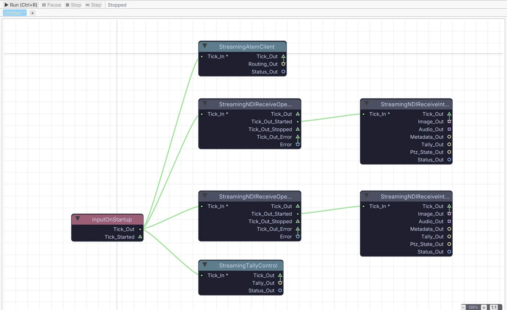

### Camera, depth, tracking, and vision

Blob tracking finds and follows shapes with IDs that stay put from frame to frame, four detection modes, recovery when a blob is hidden for a moment, and zone enter, exit, and dwell events. ImageOpticalFlow measures motion at every pixel to drive motion blur and warps, and there are corner, contour, connected-region, and template-match nodes alongside.

Depth, pose, hand, face, and segmentation models run on your own machine (Metal, CUDA, or CPU), not over the internet, with no account or API key. Depth Anything turns a single image into a depth map and then geometry; pose finds 17 body points, hands find 21, faces find 68; and Segment Anything cuts objects out by prompt, grid, or click. Each result comes out as a table per detection, so it feeds particles, lights, and parameter mappings directly. Webcams, video files, and screen or window capture are the inputs, and OutputVideoFile records any picture in the graph to a video file.

`computer vision` · `blob tracking` · `track ID` · `MOG2` · `optical flow` · `Lucas-Kanade` · `connected components` · `Harris corner` · `template matching` · `depth estimation` · `Depth Anything` · `point cloud` · `pose estimation` · `RTMPose` · `hand tracking` · `BlazePalm` · `face landmarks` · `Segment Anything` · `webcam` · `screen capture`

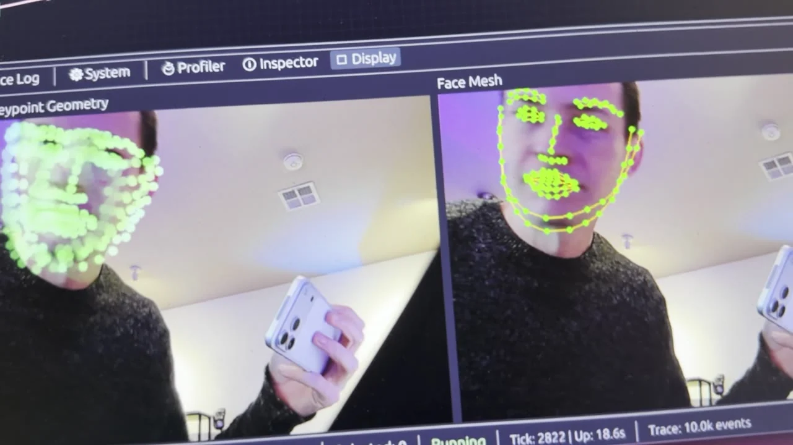 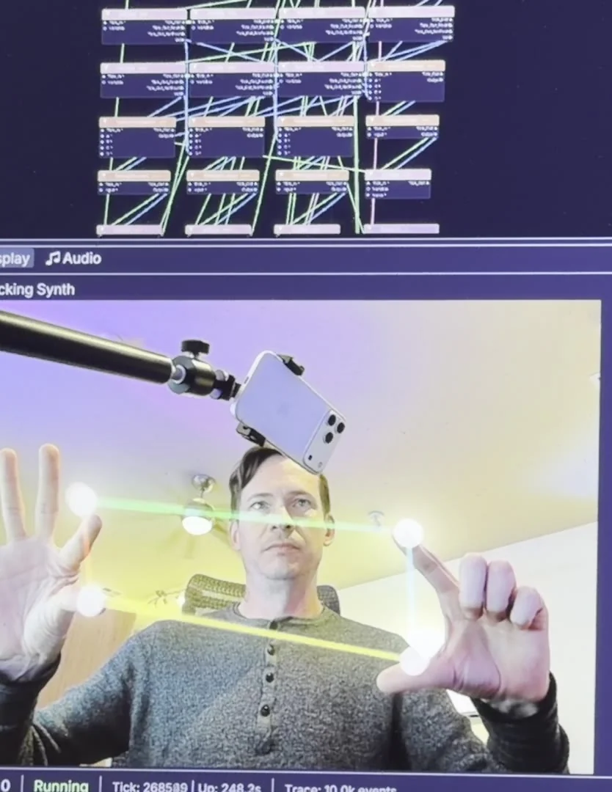

### On-device AI for images, 3D, and speech

The LocalAI nodes run on your own machine too. The image nodes upscale, cut out backgrounds, brighten dark footage, restore old or damaged photos, and erase a person or object from a picture. The 3D nodes turn a photo into textured 3D objects or a whole composed scene, a single object into a splat, and a person into a full-body mesh; LocalAICameraSolve works out the camera move from a video. LocalAIAudioTranscribe turns speech into text for captions or voice cues, and LocalAITextToSpeechAudio speaks text aloud. Most models download the first time you use them; a few small ones come with the app.

`on-device AI` · `local AI` · `image upscale` · `background removal` · `photo restoration` · `object removal` · `image to 3D` · `photo to mesh` · `camera solve` · `speech to text` · `Whisper` · `text to speech`

### Scripting: Python and JavaScript

The studio comes with its own Python, so there is nothing to install on the show machine. Four node types run Python in the graph: a full script with its own ports, a one-line expression, a generator, and a callback. Each keeps its ports and settings through a typo, and picks up again as soon as the script runs.

A tabbed editor has highlighting, completion for the ogex module, and a debugger with breakpoints, stepping, and watches across every Python node at once. A docked console talks to the live graph, and a Packages window installs pip packages into a bundled environment. The ogex module reaches every part of the app, from ogex.audio and ogex.midi to ogex.geo, ogex.shader, and ogex.ui, with an API reference built in. JavaScript also runs, in a sandbox.

`Python` · `PythonScriptNode` · `embedded Python` · `REPL` · `debugger` · `breakpoint` · `watch expression` · `code completion` · `headless rendering` · `JavaScript` · `sandboxed scripting`

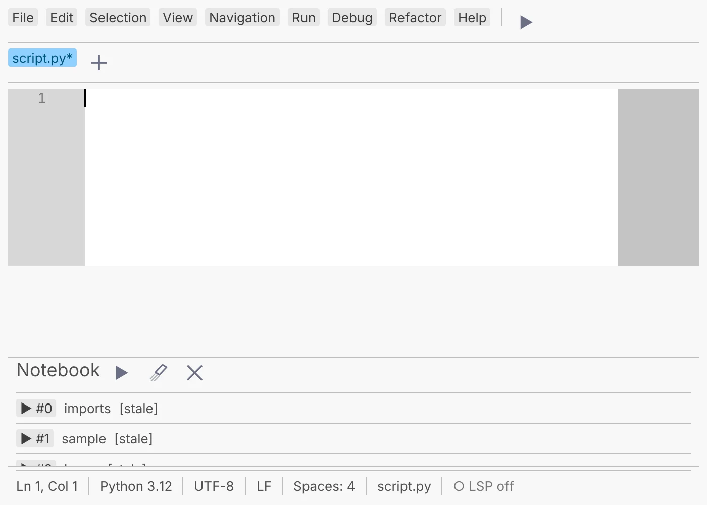 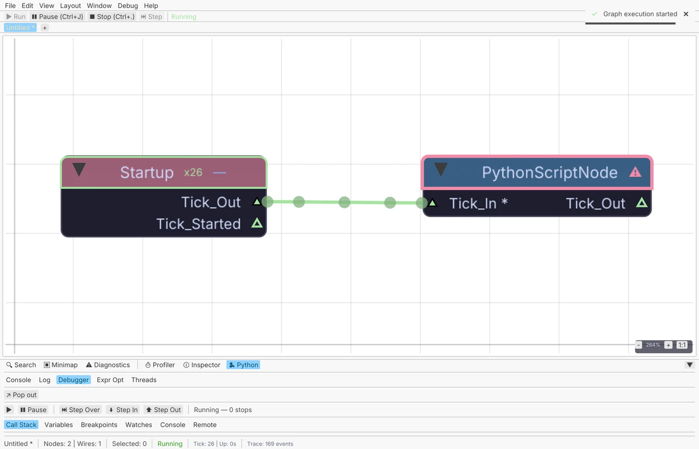

### Control surfaces and UI widgets

The UI nodes are on-canvas controls and displays: sliders, dials, XY pads, a joystick, toggles, an onscreen keyboard, plus gauges, meters, a spectrum analyzer, and scopes. Editor widgets let you shape data by hand and save it in the graph: a Bezier curve editor, an ADSR envelope, gradient and color pickers, a step sequencer, a filter designer, a spectrum you paint and hear, and a PBR material editor. Widgets group into popout panels and bind to MIDI or OSC with Learn.

`UI widget` · `control surface` · `slider` · `dial` · `XY pad` · `joystick` · `color picker` · `gauge` · `level meter` · `spectrum analyzer` · `curve editor` · `ADSR envelope` · `step sequencer` · `Stream Deck` · `parameter mapping`

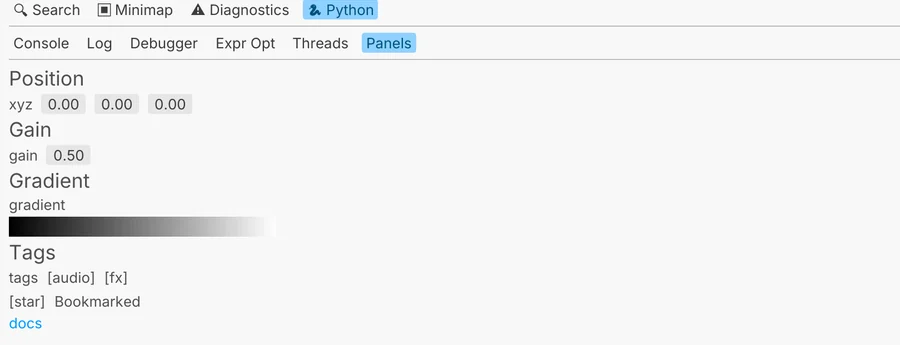 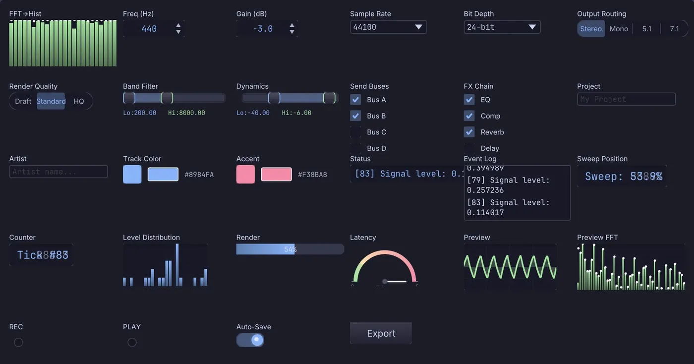

## The studio

### Canvas, palette, and wiring

The canvas has color-coded nodes and pins, and wires drawn in the color of the data passing through them. Space opens quick-add, filtered as you type. Drag from a pin and the inputs that fit light up; drop on a node and it connects, drop on empty canvas and you get a menu of nodes that take that data. There is a three-pane palette, box-select, align, distribute, and snap, a minimap, and numbered view bookmarks.

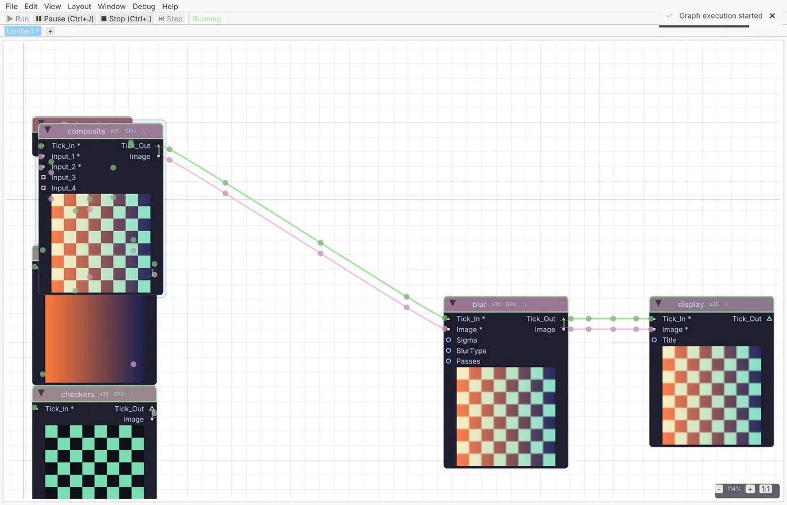

### The viewport

Above the canvas sits the main viewport. It shows whatever the selected or pinned node puts out: an image, a 3D scene with gizmos, a volume, a DMX grid, MIDI, a vector drawing, or a table. A node with no picture of its own gets a node view showing what it is reading, writing, and doing, so there is always something to look at. Rig skeletons and skin weights are edited and painted right in the viewport.

### Perform Mode

Press F1 and the editor disappears: menus, panels, and canvas go, and the window shows your show output alone, on the monitor you pick. The Outputs window lays out the perform window, projector windows, and surfaces across your displays, and Identify shows which monitor is which. Esc brings back the editor exactly as you left it.

### Inspector, drivers, and undo

The Properties panel edits a node's settings with the right control for each one, keeps values in range, hides settings that don't apply, and badges anything that needs fixing. The Inspector adds Watches that pin a node, port, or wire and show live values and timing.

Any setting can be driven by an expression that runs every frame: a fast driver (stored with a leading `#`) using time, frame, sin, clamp, lerp, channel, and osc, or a Python driver (`@`). The editor previews the curve at t=0, 0.5, and 1.0, and a driven setting shows its expression in amber and its live value beside it. Canvas edits and Python changes all undo with Cmd+Z (Ctrl+Z on Windows and Linux), and Cmd+Shift+P opens a command palette.

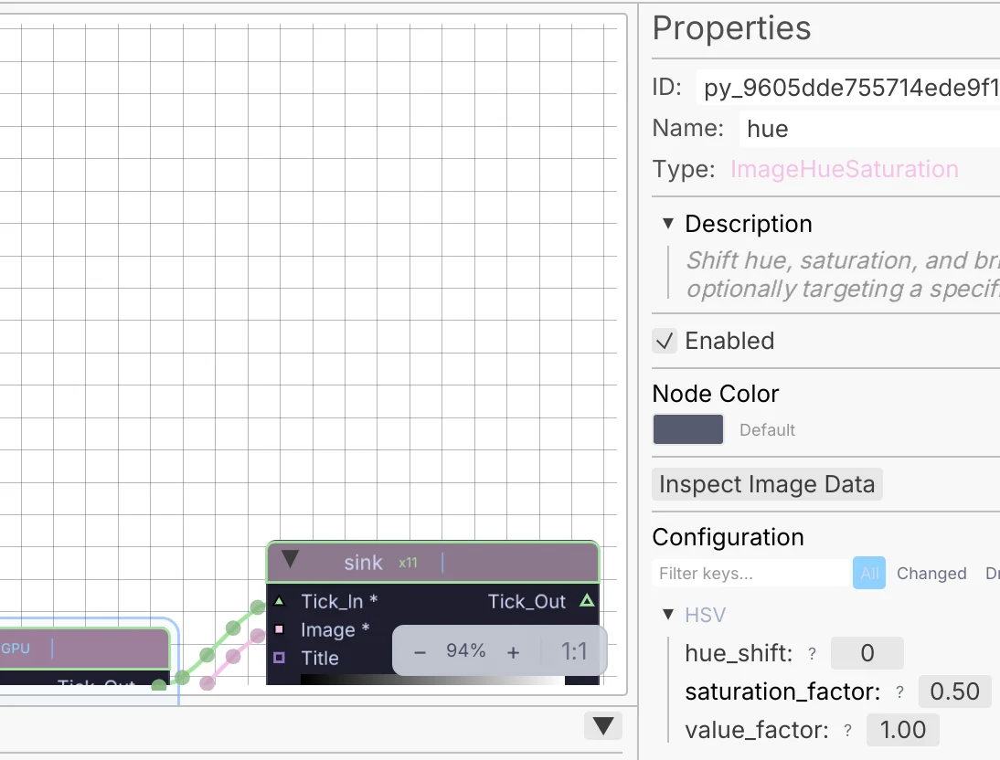

### Components and the .ogex file

A Component wraps a subgraph as one node with its own ports. Double-click to step inside, use the breadcrumb to step back out, and pick which settings the Component shows on the outside with the Public Property Editor.

Graphs save as plain JSON in the .ogex format, readable and diffable in git. Node positions, colors, and groups sit in their own `_editor` block, apart from the logic. A file can also carry the project tempo and the network settings for streaming.

### Editor windows

OGEX opens dedicated editor windows for specific nodes. Each one reads its node live and writes every edit back to it, so changes from Python, OSC, or hardware show up straight away, save in the .ogex, and undo.

- **DMX console.** About two dozen windows for the lighting workflow, including Patch Table, Groups, Personality Editor, Gel Picker, Master Live, Cuelist, Programmer, Submasters, Palette pools, Pixel Matrix, Magic Sheet with PNG export, Surface Layout, a 3D viewer, RDM Discovery, network topology, packet capture, pre-show and channel checks, test patterns, the scheduler, macros, and a show diary.
- **MIDI.** A Piano Roll with velocity and CC lanes and recording, plus Clips, Transport, Devices, Monitor and Learn, Routing Matrix, Profile Library and editor, Controller Surface, Patch Librarian, SysEx editor, and Song/Setlist.
- **OSC and Ableton.** An OSC Monitor, Namespace and OSCQuery browsers, Mappings, and Learn; plus an Ableton Live Companion that mirrors Live's session view, with Scenes, Cue Points, Sends, a Device inspector, and Push Surface.
- **Streaming and mocap.** A Sources window of live thumbnails you drag onto the canvas to get a wired-up receiver, a Tally Master, a PTZ Controller, a Stream Deck Layout, Network Settings and Status, and the Mocap window for performers, calibration, and takes.
- **Visual editors.** A shader editor that compiles as you type, with completion and errors underlined in your code; a Compositor; the Projection Mapper; a keyframe editor; and a video timeline with video and audio clips, transitions, render to file, and EDL and SRT export.
- **Inspectors.** An orbit viewport for geometry, scenes, and materials with a scene tree and attribute spreadsheet; a material preview under several HDRIs; a volume and SDF viewer; and a heightfield sampler.
- **Serial.** Devices and a Monitor for microcontrollers.

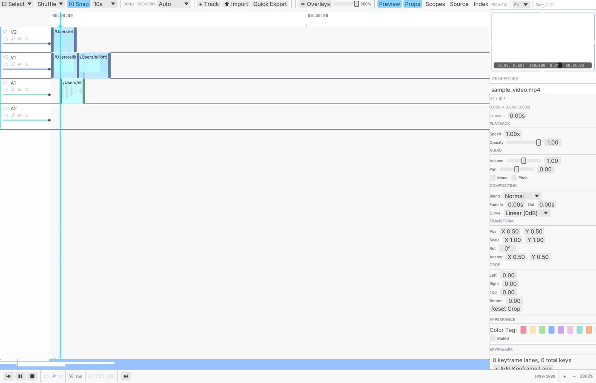

### Diagnostics and preferences

A Diagnostics panel collects warnings and errors, with Console, Change Log, Statistics, and Trace Log tabs. A Profiler shows what each node costs per frame, with CSV export, and a System Monitor graphs CPU, RAM, and GPU. Preferences cover appearance, viewport, layout, devices, models, Python, and shortcuts. Four Catppuccin themes are built in, with a colorblind-safe mode and a night mode for dark venues. The top bar holds Run, Pause, Stop, and Step, the status bar counts ticks, and each node's header shows whether it ran on the GPU or the CPU.

## What you can build

- Live concert and club visuals that follow the music over MIDI, OSC, or Ableton Live.
- Museum and gallery installations driven by cameras, depth sensors, and hand tracking.
- Projection-mapped stage sets, domes, and sculptures.
- DMX lighting rigs and LED walls, with the console windows, fixture library, and timecode chase in the same graph as the visuals.
- Characters driven live by a mocap suit or a phone.
- Generative art and motion pieces from shaders, particles, splats, fluids, geometry, and terrain.
- Broadcast and streaming setups with NDI, Syphon, RTMP, and tally.

## Requirements

- **macOS.** macOS 12.3 (Monterey) or later, Apple Silicon (M-series). Signed with a Developer ID and notarized by Apple.
- **Windows.** 64-bit Windows 10 version 1809 or later, and Windows 11. Code signed.
- **Linux.** Ubuntu 24.04 LTS or newer, on glibc 2.39 or newer. X11 and Wayland both work.
- **Raspberry Pi.** Pi 5 on 64-bit Raspberry Pi OS. The Pi's graphics chip can't run the GPU fluid simulation or blend 32-bit float renders, and those nodes say so rather than quietly giving you the wrong picture. Everything else runs.
- Graphs are JSON files, and can also run with no window using `ogex-studio --headless`.

Every platform is on 0.4.6.

## Links

- Website and gallery: https://ogex.app
- Features: https://ogex.app/features
- Showreel: https://www.youtube.com/watch?v=JXA2xRo9f88

---

Keywords: node-based visual programming, dataflow, creative coding, live visuals, VJ software, generative art, TouchDesigner alternative, Max/MSP, vvvv, Notch, live graphics node editor, GPU particles, Gaussian splatting, fluid simulation, smoke and fire, FLIP liquids, WGSL, GLSL, Shadertoy, shader live coding, PBR rendering, OpenColorIO, XPBD cloth simulation, soft body physics, rigid body dynamics, rigging, character animation, motion capture, SDF, NURBS, procedural geometry, terrain generation, DMX, Art-Net, sACN, lighting control, projection mapping, NDI, Syphon, RTMP, OSC, Ableton Live, MIDI router, RTP-MIDI, MPE, sequencer, computer vision, on-device AI, face tracking, hand tracking, depth camera, interactive installation, macOS, Apple Silicon, Windows, Linux, Ubuntu, Raspberry Pi, arm64.
